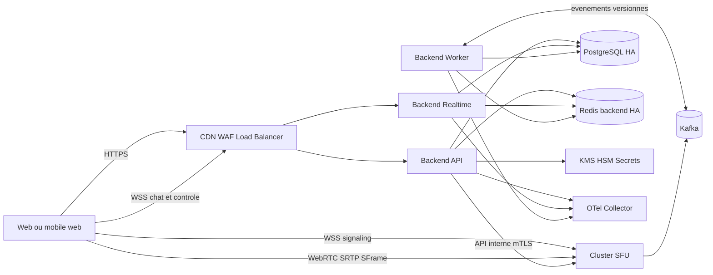
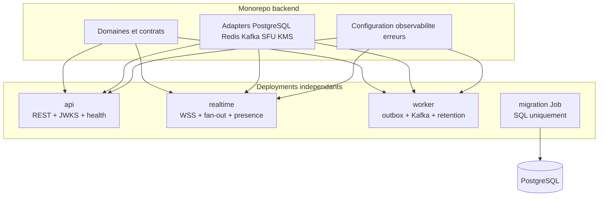
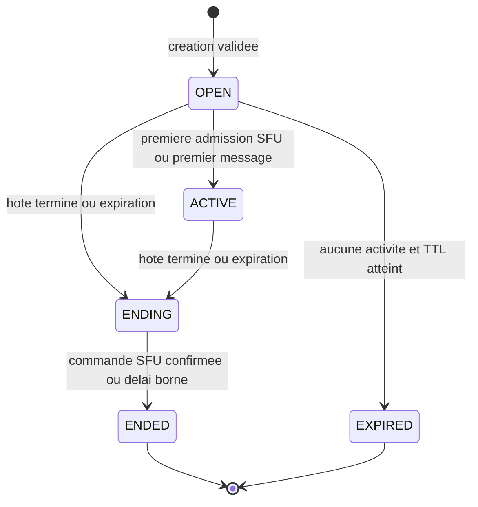
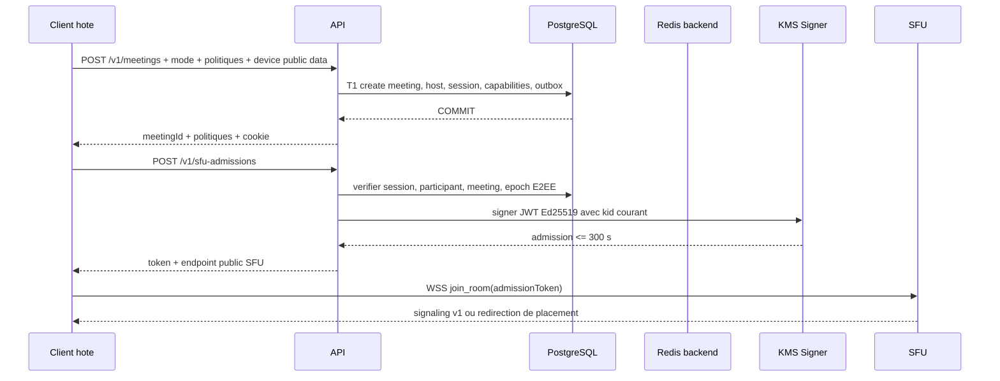
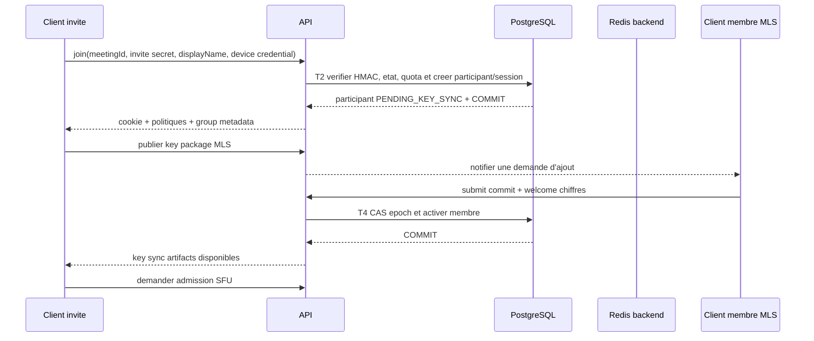
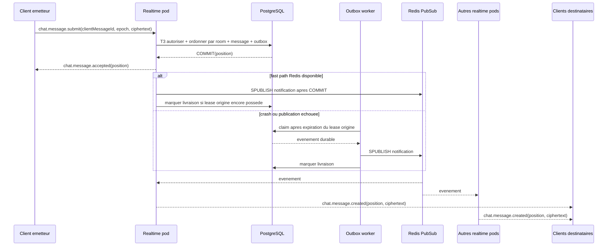
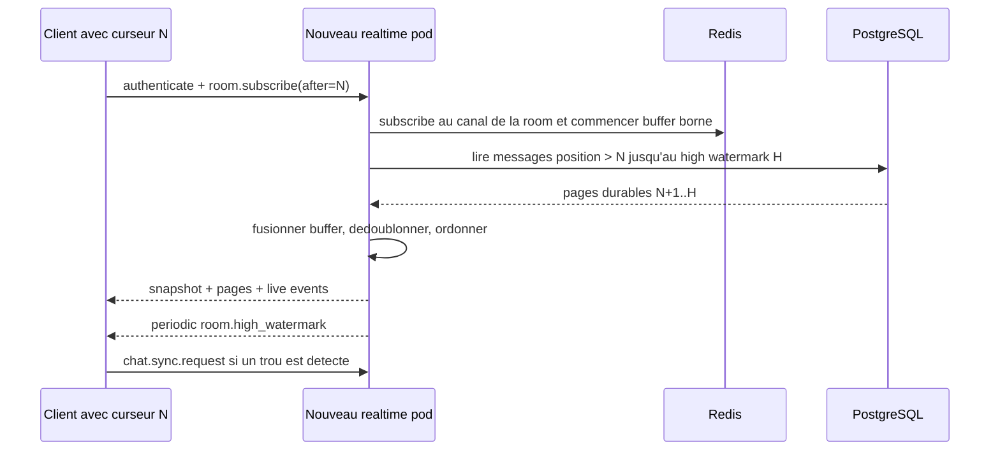
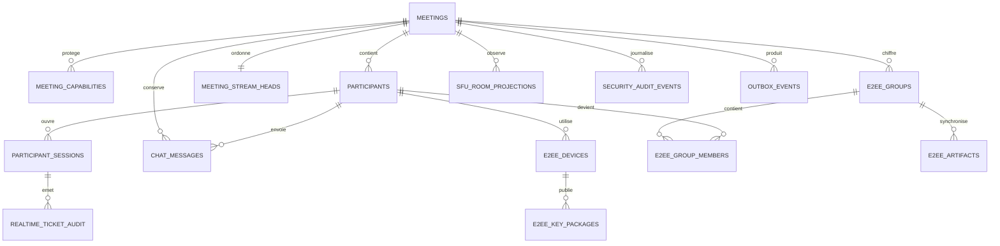
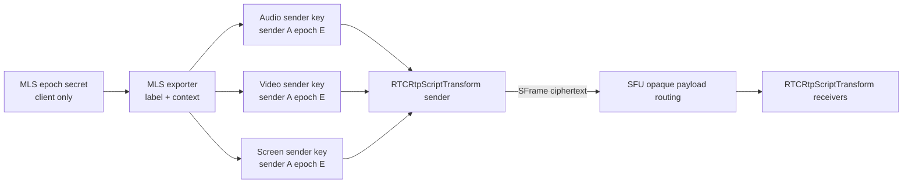
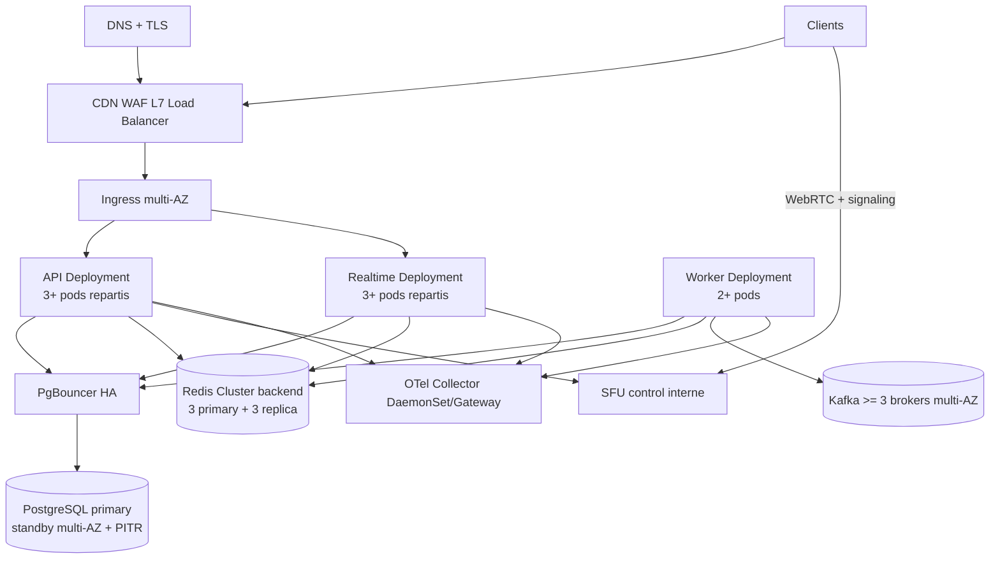

# Specification d'architecture du backend temps reel

## 1. Statut et objectif

Ce document fixe l'architecture cible du backend applicatif qui relie le
frontend `hello-friend` au `sfu-server`. Il transforme le cadrage fonctionnel
du document `01-cadrage-backend-temps-reel.md` en contrats techniques
implementables, testables et deployables.

Le systeme couvre trois modes :

- visioconference avec chat de groupe ;
- appel audio avec chat facultatif selon la politique de la reunion ;
- live avec presentateurs, audience et chat de masse.

Il n'existe pas de compte utilisateur global. Une personne cree une reunion,
recoit une capacite d'hote et partage une capacite d'invitation. Chaque appareil
obtient ensuite une identite pseudonyme limitee a cette reunion. Cette absence
de compte ne supprime ni l'authentification ni l'autorisation : elle remplace
l'identite durable par des capacites aleatoires, des sessions anonymes bornees
et des droits explicites.

Cette specification est normative pour le backend. Les valeurs de charge, de
retention, de regions et de SLO encore ouvertes dans le cadrage sont des
parametres de deploiement ; elles ne doivent pas etre inventees silencieusement
dans le code.

### 1.1 Decisions fermees

| Sujet | Decision normative |
| --- | --- |
| Runtime | Node.js 24 LTS, TypeScript strict |
| Framework | NestJS avec adaptateur Fastify pour HTTP et adaptateur natif `ws` pour WSS |
| Forme du code | Monolithe modulaire, execute en trois processus independants : API, realtime et worker |
| Base durable | PostgreSQL 18.6, mineure stable courante, service HA manage en production |
| Acces SQL | `node-postgres`, repositories explicites, migrations SQL versionnees |
| Temps reel | WebSocket natif WSS ; aucun faux bus en memoire en production |
| Redis | Redis 8.2 Extended dedie au backend, HA, TLS, ACL ; presence, tickets, quotas et fan-out uniquement |
| Kafka | Consommation des evenements SFU et publication d'evenements backend durables |
| Medias | Le navigateur dialogue directement avec le SFU ; le backend ne relaie jamais RTP/RTCP |
| Chat | Le ciphertext est durable dans PostgreSQL ; Redis accelere uniquement la diffusion |
| E2EE chat | MLS est la cible ; le serveur agit comme Delivery Service et ne recoit pas les secrets de groupe |
| E2EE media | SFrame au-dessus de WebRTC Encoded Transform ; le SFU ne recoit pas les cles |
| Session | Cookie opaque `HttpOnly` pour HTTP, ticket WSS a usage unique pour le premier message WebSocket |
| Admission SFU | JWT tres court, a usage unique, signe Ed25519 et publie par JWKS |
| Secrets | Fichiers montes ou fournisseur KMS/HSM ; aucun secret de production dans l'environnement brut ou Git |

Node.js 24 est une ligne LTS maintenue, Nest fournit des frontieres de modules et
des providers injectables, et son adaptateur Fastify vise le chemin HTTP haute
performance.[^1][^2][^3][^4] PostgreSQL maintient chaque version majeure cinq
ans ; la version majeure et les mineures doivent rester epinglees et mises a
jour selon sa politique officielle.[^5] Redis 8.2 est retenu deliberement comme
branche Extended maintenue jusqu'en 2030, avec application de chaque patch de
securite ; un changement vers une branche Standard plus recente passe par les
memes tests Cluster, scripts et failover.[^81]

### 1.2 Invariants non negociables

1. PostgreSQL est la verite durable pour les reunions, participants, sessions,
   messages, etats E2EE, outbox, inbox et audit.
2. Une reponse `accepted` pour un message n'est emise qu'apres `COMMIT` de son
   message et de son evenement outbox dans la meme transaction.
3. Redis peut etre vide, redemarre ou perdre une notification sans perdre un
   message accepte.
4. Tous les consommateurs Kafka et tous les recepteurs d'outbox sont
   idempotents ; l'at-least-once implique des doublons possibles.[^6]
5. Une autorisation est verifiee a chaque commande HTTP ou WSS. Une connexion
   WebSocket authentifiee n'est jamais un droit illimite.[^7]
6. Ni le backend, ni le SFU, ni Redis, ni Kafka, ni les logs ne voient le texte
   clair d'un message E2EE ou une cle de contenu.
7. Le backend ne lit ni n'ecrit les cles Redis privees du SFU et ne manipule
   aucune instance mediasoup.
8. Toute file, map, cache, pool, batch, taille de message, tentative et attente
   possede une limite configuree et une metrique.
9. Une fermeture retire d'abord la readiness, refuse les nouveaux travaux,
   draine dans un delai borne, puis ferme les sockets, consommateurs, pools et
   exporters. Nest n'active les hooks de terminaison que lorsqu'ils sont
   explicitement configures.[^8]
10. Les horloges de tous les noeuds sont synchronisees ; JWT, leases, epochs,
    expiration et mesures de latence en dependent.

## 2. Qualites visees et frontieres

### 2.1 Responsabilites

Le backend est le plan de controle et le domaine applicatif. Il est responsable
de la creation et de la fin des reunions, des capacites d'acces, des sessions
anonymes, des roles produit, de la messagerie, de la coordination E2EE, de
l'emission des admissions SFU, de la consommation des evenements SFU et de
l'audit de securite.

Le SFU est le plan media. Il reste responsable du signaling mediasoup, des
transports WebRTC, des producteurs et consommateurs, du simulcast, de la QoS,
du placement multi-noeuds, de la reprise courte et de l'enregistrement non-E2EE.
Mediasoup ne prescrit pas le protocole applicatif entre client et serveur ; le
contrat deja implemente par le SFU demeure donc l'autorite de cette integration.[^9]

Le frontend est responsable de l'interface, des appareils, de l'etat local
ephemere, du chiffrement/dechiffrement et du dialogue direct avec le SFU. Les
API WebRTC Encoded Transform exposent les trames encodees au transformateur du
client avant leur transport.[^10]

### 2.2 Hors perimetre

- comptes, mots de passe, profils globaux, reseau social ou facturation ;
- proxy media dans le backend ;
- stockage du texte clair des messages ;
- lecture des contenus E2EE par une moderation serveur invisible ;
- implementation maison de MLS, SFrame, AES-GCM ou d'une primitive
  cryptographique ;
- couplage direct du backend aux classes internes ou au Redis du SFU ;
- promesse d'enregistrement invisible d'une reunion E2EE.

### 2.3 Objectifs mesurables

Les seuils definitifs viennent du profil de charge valide, mais chaque
deploiement doit definir et alerter au minimum : disponibilite API et WSS,
latences p50/p95/p99, temps du commit d'un message, delai outbox, retard Kafka,
taux de reconnexion, sockets actives, octets en attente par socket, taux de
messages refuses, saturation des pools, taux d'erreurs E2EE et duree de
rattrapage. Les histogrammes servent aux observations distribuees de latence ;
leurs buckets doivent etre choisis autour des SLO et rester stables.[^11]

## 3. Vue de contexte



Le trafic navigateur utilise exclusivement HTTPS/WSS et WebRTC securise. Le
load balancer doit conserver les upgrades WebSocket, appliquer des timeouts
compatibles avec les connexions longues et propager l'adresse cliente seulement
depuis des proxies de confiance. Les exigences de validation de l'origine,
d'authentification, de limites de taille et de journalisation WSS suivent les
recommandations OWASP.[^7] Le protocole WebSocket reste RFC 6455 ; HTTP/2 et
HTTP/3 peuvent transporter l'amorcage seulement si toute la chaine supporte
respectivement RFC 8441 ou RFC 9220.[^12][^13][^14]

## 4. Architecture d'execution

### 4.1 Trois processus, un seul modele de domaine



Le meme artefact immuable peut contenir les trois points d'entree, selectionnes
par `APP_ROLE`. Ils partagent les types et cas d'usage mais pas leur cycle de
vie, leur pool, leur autoscaling ni leur budget de ressources.

| Processus | Expose | Dependances obligatoires | Responsabilites |
| --- | --- | --- | --- |
| `api` | HTTPS REST, JWKS, health, metrics | PostgreSQL ; Redis pour tickets/quotas ; KMS pour signer | creation/join, sessions, commandes de reunion, admission SFU, pagination, artefacts E2EE |
| `realtime` | WSS, health, metrics | PostgreSQL, Redis | authentifier ticket, souscrire, soumettre, rattraper, presence, backpressure |
| `worker` | health et metrics internes | PostgreSQL, Redis, Kafka | relayer outbox, consommer SFU, retention, nettoyage, alertes de poison |
| `migration` | rien | PostgreSQL | prendre le verrou de migration, appliquer une version, terminer |

L'API et le realtime sont sans affinite de session : un client peut atteindre
n'importe quel pod. Les sessions sont dans PostgreSQL, les tickets et la
presence ephemere dans Redis, et le chat est rattrapable depuis PostgreSQL. Le
realtime garde seulement les connexions qu'il sert et des buffers strictement
bordes.

### 4.2 Topologie des dependances de code

```text
apps/api        -> application ports <- infrastructure adapters
apps/realtime   -> application ports <- infrastructure adapters
apps/worker     -> application ports <- infrastructure adapters
                         |
                       domain

domain        : entites, value objects, regles, erreurs ; aucune dependance Nest/SQL/Redis
application   : cas d'usage, ports, commandes, resultats, transactions
infrastructure: repositories SQL, clients Redis/Kafka/SFU/KMS, migrations
transport     : controllers, schemas REST/WSS, mapping RFC 9457, serialization
```

Le domaine n'importe pas NestJS, `pg`, Redis, Kafka ou le client SFU. Les
controllers et gateways ne contiennent ni SQL, ni politique de droits, ni
cryptographie. Ils valident l'enveloppe, appellent un cas d'usage et traduisent
le resultat. Les providers Nest sont relies par interfaces/tokens et les
schemas d'entree refusent les proprietes inconnues.[^3][^15][^16]

### 4.3 Arborescence cible

```text
src/
  apps/
    api/
      bootstrap.ts
      api.module.ts
    realtime/
      bootstrap.ts
      realtime.module.ts
    worker/
      bootstrap.ts
      worker.module.ts
  modules/
    meetings/
      domain/
      application/
      infrastructure/
      transport/http/
      transport/ws/
    participants/
    capabilities/
    sessions/
    chat/
    e2ee/
    sfu-integration/
    outbox/
    inbox/
    presence/
    audit/
  platform/
    config/
    database/
    redis/
    kafka/
    crypto/
    observability/
    health/
    errors/
  contracts/
    http/v1/
    realtime/v1/
    events/v1/
migrations/
test/
  unit/
  integration/
  contract/
  e2e/
  load/
  soak/
  chaos/
```

Chaque repertoire `domain`, `application`, `infrastructure` et `transport`
contient plusieurs fichiers coherents. Les types de protocole, constantes,
schemas de validation, ports et implementations ne sont pas melanges dans un
fichier geant. Une exception est acceptee seulement pour un tres petit value
object dont la separation augmenterait le couplage au lieu de le reduire.

### 4.4 Modules et ownership

| Module | Possede | Ne possede pas |
| --- | --- | --- |
| `meetings` | cycle de vie, mode, politiques, fin de reunion | session WebSocket, media |
| `capabilities` | invitation/hote, HMAC, expiration, revocation | cookie de session |
| `participants` | pseudonyme, role produit, etat, droits | transport mediasoup |
| `sessions` | session anonyme, rotation, ticket realtime | capacite partageable |
| `chat` | ordre, ciphertext, pagination, idempotence | cle de dechiffrement |
| `e2ee` | appareils, key packages, epochs, commits, welcomes | primitives cryptographiques maison |
| `sfu-integration` | admission JWT/JWKS, control port, projections Kafka | classes et Redis internes au SFU |
| `outbox` | livraison asynchrone durable | mutation metier initiale |
| `inbox` | deduplication des evenements externes | offset Kafka avant commit metier |
| `presence` | connexions et heartbeats ephemeres | preuve durable de participation |
| `audit` | evenements de securite sans secret | contenu de chat |

Les dependances intermodules passent par des ports d'application explicites ou
des evenements internes immuables. Aucun module ne lit directement les tables
d'un autre module depuis un controller. Les transactions multi-domaines sont
orchestrees par un cas d'usage applicatif et un `UnitOfWork` PostgreSQL partage.

## 5. Modele de domaine

### 5.1 Agregats

`Meeting` est l'agregat racine des politiques et du cycle de vie. `Participant`
est limite a une reunion. `AnonymousSession` lie un navigateur/appareil a un
participant sans creer un compte global. `ChatMessage` est un journal immuable
de ciphertext. `E2eeGroup` coordonne l'epoch et les artefacts publics ou
chiffres, sans jamais contenir le secret de groupe.

### 5.2 Etats de reunion



`ENDING` interdit toute nouvelle admission et toute nouvelle publication, mais
laisse le worker terminer l'audit, la revocation et la livraison outbox. Une
repetition de `end meeting` retourne le meme resultat. Un evenement SFU en
retard ne peut jamais remettre une reunion `ENDED` en `ACTIVE`.

### 5.3 Etats participant et session

Un participant suit `PENDING_KEY_SYNC -> ACTIVE -> LEFT` ou `REVOKED`. Pour une
reunion E2EE, l'admission media productrice n'est delivree qu'apres la preuve que
l'appareil appartient a l'epoch MLS courant. Un viewer live peut etre actif
pour la consommation media sans droit de publier.

Une session suit `ACTIVE -> ROTATING -> REVOKED|EXPIRED`. La rotation cree un
nouveau secret opaque et invalide l'ancien de maniere atomique. La revocation
ferme les WSS actifs, invalide les tickets et demande la revocation SFU via le
port interne.

### 5.4 Matrice produit vers SFU

Les roles SFU acceptes sont uniquement `host`, `speaker` et `viewer`. Un role
ne confere aucun droit implicite : le tableau `permissions` est l'autorite. La
liste SFU actuelle est fermee a ces onze valeurs : `room:join`,
`transport:create:send`, `transport:create:recv`, `media:produce:audio`,
`media:produce:video`, `media:consume`, `data:produce`, `data:consume`,
`e2ee:enable`, `room:moderate`, `recording:manage`.[^82]

| Mode / role produit | Role SFU | Permissions SFU |
| --- | --- | --- |
| visio hote | `host` | join, transport send+recv, produce audio+video, consume, E2EE, moderate |
| visio participant | `speaker` | join, transport send+recv, produce audio+video, consume, E2EE |
| audio hote | `host` | join, transport send+recv, produce audio, consume, E2EE, moderate ; jamais produce video |
| audio participant | `speaker` | join, transport send+recv, produce audio, consume, E2EE ; jamais produce video |
| live hote | `host` | join, transport send+recv, produce audio+video, consume, E2EE, moderate |
| live presenter | `speaker` | join, transport send+recv, produce audio+video, consume, E2EE |
| live viewer | `viewer` | join, transport recv, consume, E2EE ; jamais transport send/produce |

`data:produce` et `data:consume` ne sont accordes que si une fonctionnalite SFU
utilise effectivement les DataChannels. Le chat applicatif reste sur le WSS du
backend. `recording:manage` est absent de toute admission E2EE ; il peut etre
accorde a l'hote d'une reunion non-E2EE si l'enregistrement est active.

## 6. Surfaces publiques et contrats

La specification detaillee des payloads appartient au futur contrat de
protocole, mais les responsabilites et invariants ci-dessous sont fixes. Toutes
les routes sont versionnees sous `/v1`. Les erreurs HTTP utilisent
`application/problem+json` selon RFC 9457, sans stack, secret ni detail interne.[^17]

### 6.1 Routes HTTP

| Methode et route | Authentification | Effet |
| --- | --- | --- |
| `POST /v1/meetings` | quota anti-abus public | cree reunion, participant hote et session a partir de capacites client CSPRNG |
| `POST /v1/meetings/{meetingId}/join` | capacite invite + preuve appareil | cree ou reprend un participant et une session bornee |
| `GET /v1/session/bootstrap` | cookie de session | etat minimal et nouveau jeton CSRF garde en memoire client |
| `GET /v1/meetings/{meetingId}` | session de la reunion | retourne etat, mode, politiques et droits, jamais les secrets |
| `POST /v1/realtime-tickets` | cookie de session | emet un ticket WSS a usage unique et tres court |
| `POST /v1/sfu-admissions` | session active + appareil E2EE pret | signe une admission SFU juste a temps |
| `GET /v1/meetings/{meetingId}/messages` | session autorisee | pagination curseur de ciphertext et metadonnees |
| `POST /v1/meetings/{meetingId}/end` | capacite/session hote | transition idempotente vers `ENDING` |
| `POST /v1/meetings/{meetingId}/participants/{participantId}/revoke` | droit de moderation | revoque session, realtime, E2EE et SFU |
| `POST /v1/e2ee/devices` | session active | enregistre la cle publique et emet une credential appareil signee |
| `POST /v1/e2ee/key-packages` | appareil authentifie | publie des key packages MLS bornes et signes |
| `GET /v1/e2ee/groups/{groupId}/artifacts` | membre autorise | recupere commits, welcomes et etat public apres un curseur |
| `GET /.well-known/jwks.json` | public, cache borne | publie seulement les cles publiques d'admission actives |
| `GET /.well-known/e2ee-credential-jwks.json` | public, cache borne | cles publiques distinctes de l'Authentication Service E2EE |
| `GET /live` | interne | processus vivant, aucune dependance externe |
| `GET /ready` | interne | dependances necessaires et drainage inactif |
| `GET /metrics` | reseau interne + auth plateforme | metriques Prometheus sans identifiants de reunion |

Les operations mutantes recoivent un identifiant de commande unique. Le meme
identifiant et le meme fingerprint retournent le resultat initial ; un meme
identifiant avec un contenu different est rejete comme conflit. La validation
et la serialization sont faites par schemas et non par concatenation de
chaines ; Fastify compile ces schemas pour les chemins chauds.[^16]

### 6.2 Capacites et URLs partagees

`meetingId` est un identifiant public non secret. Le frontend genere avec Web
Crypto la capacite hote et la capacite invite comme deux valeurs aleatoires
independantes de 256 bits, puis les envoie uniquement sur HTTPS dans la commande
idempotente de creation. Le
serveur ne stocke que `HMAC-SHA-256(pepperVersion, secret)` et compare en temps
constant. La capacite hote n'est jamais derivee de l'invitation et ne figure
jamais dans les logs, traces, analytics, WAF bodies ou referers.[^52]

Le lien partage place le secret apres le fragment, par exemple
`https://app.example/room/{meetingId}#invite={secret}`. Le fragment est traite
par le client et n'est pas inclus dans l'action de recuperation de la ressource
HTTP selon le modele URI.[^18] Le frontend l'echange immediatement contre une
session puis remplace l'URL visible. Cette mesure limite les fuites reseau ; elle
ne protege pas contre un script deja compromis dans l'origine.

Un eventuel code humain est une capacite distincte, moins privilegiee,
expirable, revocable et fortement limitee par IP/prefixe et reunion. Il ne
remplace jamais un secret aleatoire de 256 bits pour le role hote.

### 6.3 Session anonyme et ticket WSS

La session HTTP utilise un token opaque aleatoire de 256 bits dans un cookie
`__Host-hf_session`, `Secure`, `HttpOnly`, `Path=/`, `SameSite=Strict`, sans
attribut `Domain`. Le serveur conserve uniquement son digest HMAC, la version
du pepper, l'expiration, l'inactivite, l'appareil, le participant et la date de
revocation. OWASP recommande les cookies comme mecanisme d'echange des session
IDs, interdit leur passage en URL et demande au moins 128 bits d'entropie pour
un identifiant cree sur mesure.[^19]

Les mutations HTTP exigent aussi une origine exacte, des en-tetes Fetch Metadata
coherents et un jeton CSRF aleatoire lie a la session. Son digest est conserve
cote serveur ; sa valeur est rendue par le bootstrap same-origin, gardee en
memoire et envoyee dans un header dedie. Une origine absente ou non autorisee
echoue fermee sur le client web supporte.

Pour WSS, le navigateur demande un ticket opaque via HTTPS. Le ticket :

- expire tres rapidement selon `REALTIME_TICKET_TTL_SECONDS` ;
- est lie a la session, la reunion, l'origine et l'appareil ;
- est conserve sous forme de digest dans Redis ;
- est consomme atomiquement une seule fois ;
- est envoye dans le premier message `session.authenticate`, jamais dans l'URL ;
- doit arriver avant `REALTIME_AUTH_TIMEOUT_MS`, sinon le socket est ferme.

Le handshake valide aussi une allowlist exacte de l'en-tete `Origin`. Chaque
commande revalide l'etat de la session et son droit ; la revocation ferme toutes
les connexions indexees pour cette session. Cela repond au risque de Cross-Site
WebSocket Hijacking sans exposer de token dans les access logs.[^7]

### 6.4 Protocole realtime v1

Les messages de controle sont des enveloppes JSON strictes :

```json
{
  "v": 1,
  "id": "uuid-de-commande",
  "type": "chat.message.submit",
  "payload": {}
}
```

Le serveur repond avec le meme `id` pour les resultats de commande et un
`eventId` pour les evenements. Les types inconnus, versions inconnues,
proprietes supplementaires, nombres hors bornes et UTF-8 invalide sont refuses.
Le ciphertext est encode base64url dans v1 ; une v2 binaire ne peut etre adoptee
qu'apres mesure montrant que le cout JSON est significatif.

Types minimaux :

| Client vers serveur | Serveur vers client |
| --- | --- |
| `session.authenticate` | `session.authenticated` |
| `room.subscribe` | `room.snapshot` |
| `chat.message.submit` | `chat.message.accepted` |
| `chat.sync.request` | `chat.sync.page` |
| `e2ee.commit.submit` | `e2ee.commit.accepted` |
| `e2ee.artifacts.request` | `e2ee.artifact.available` |
| `presence.heartbeat` | `presence.changed` |
| `ping` | `pong` |
| aucune commande implicite | `room.ended`, `session.revoked`, `error`, `slow_consumer` |

La compression WebSocket par message est desactivee par defaut. Chaque socket
possede des compteurs de messages et d'octets entrants, une file sortante
bornee, un heartbeat, un delai d'authentification et un debit maximal. Lorsque
`bufferedAmount` ou la file depasse le seuil : les evenements de presence et de
QoS coalescables sont remplaces par leur dernier etat, les messages de chat ne
sont jamais supprimes silencieusement, puis le serveur envoie `slow_consumer`
et ferme avec un code documente si le client ne rattrape pas. La bibliotheque
`ws` expose ping/pong et doit toujours etre utilisee avec des listeners et
timers retires a la fermeture.[^20]

## 7. Flux principaux

### 7.1 Creation, partage et admission SFU



Le secret partage n'entre jamais dans l'admission SFU. L'admission est emise
apres creation de la session et uniquement quand la politique E2EE requise est
satisfaite. Un token n'est ni cache, ni reutilise, ni persiste.

### 7.2 Join d'un invite



Le backend ne fabrique pas le Welcome MLS et ne connait pas les secrets. Si
aucun membre autorise ne peut committer, le participant reste en attente ; le
systeme ne contourne pas l'E2EE en lui donnant une cle serveur.

### 7.3 Soumission et diffusion d'un message



Le serveur confirme la durabilite, pas la lecture ni meme la diffusion
instantanee. Un crash apres publication Redis et avant le marquage provoque un
doublon, elimine par `eventId` et `position`. Un crash avant publication laisse
une ligne outbox qui sera reprise.

### 7.4 Reconnexion sans trou



L'ordre `subscribe puis catch-up puis fusion` ferme la fenetre entre la lecture
PostgreSQL et l'abonnement Redis. Le buffer de transition est borne ; s'il
deborde, le serveur recommence le rattrapage depuis le dernier curseur confirme
ou ferme explicitement. Redis Pub/Sub est at-most-once et perd les messages
pendant une deconnexion ; ce rattrapage durable est donc obligatoire.[^21][^22]

## 8. Schema PostgreSQL

### 8.1 Principes SQL

- Identifiants internes/publics en UUIDv7 generes par PostgreSQL pour une bonne
  localite d'index ; PostgreSQL 18 fournit `uuidv7()` nativement.[^23]
- Horodatages en `timestamptz`, toujours UTC ; les delais metier ne reposent pas
  sur l'horloge du navigateur.
- Enumerations evolutives representees par `text` + `CHECK`, versionnees par
  migration ; aucune valeur inconnue n'est acceptee.
- Toutes les foreign keys sont indexees lorsqu'elles participent aux chemins de
  suppression, jointure ou autorisation.
- Aucun `ON DELETE CASCADE` large sur le chat, l'outbox ou l'audit. La retention
  suit des jobs explicites, observables et reprenables.
- Les contraintes `UNIQUE`, `CHECK`, `NOT NULL` et foreign keys portent les
  invariants concurrents que TypeScript seul ne peut garantir.[^24]
- Les indexes partiels ciblent les lignes actives, outbox en attente et donnees
  expirables, mais leurs predicates restent simples et stables.[^25]

### 8.2 Diagramme relationnel



### 8.3 Tables de reunion et d'acces

#### `meetings`

| Colonne | Type | Regle |
| --- | --- | --- |
| `id` | `uuid` | PK, `uuidv7()` ; identifiant public non secret |
| `mode` | `text` | `video_conference`, `audio_call`, `live` |
| `state` | `text` | `open`, `active`, `ending`, `ended`, `expired` |
| `chat_policy` | `jsonb` | schema versionne, writers/limites/retention |
| `media_e2ee_policy` | `text` | `required`, `optional`, `disabled` |
| `chat_e2ee_policy` | `text` | `required` en production initiale |
| `history_policy` | `text` | `strict_membership` ou `shared_history` |
| `version` | `bigint` | verrou optimiste, incremente a chaque transition |
| `created_at`, `activated_at` | `timestamptz` | activation nullable |
| `ends_at`, `ended_at`, `expires_at` | `timestamptz` | politique et fin effective |

Indexes : PK ; `(state, expires_at)` partiel pour les reunions non terminees ;
`(created_at)` pour retention et exploitation. Les politiques JSONB sont
validees a l'entree puis protegees par un `policy_schema_version`; elles ne sont
pas utilisees comme remplacement d'un modele relationnel pour les jointures.

#### `meeting_capabilities`

| Colonne | Type | Regle |
| --- | --- | --- |
| `id`, `meeting_id` | `uuid` | PK, FK reunion |
| `kind` | `text` | `host`, `invite`, `human_join_code` |
| `secret_digest` | `bytea` | HMAC seulement, jamais le secret brut |
| `pepper_version` | `smallint` | permet rotation et verification ancienne |
| `grant_profile` | `text` | profil de droits produit, pas permissions libres du client |
| `expires_at`, `revoked_at` | `timestamptz` | bornes obligatoires selon type |
| `max_uses`, `use_count` | `bigint` | nullable pour invitation illimitee dans la limite de reunion |
| `created_at`, `last_used_at` | `timestamptz` | audit sans IP brute persistante |

Contrainte unique `(kind, secret_digest, pepper_version)`. La validation et
l'increment de `use_count` sont atomiques sous verrou de ligne.

#### `participants`

| Colonne | Type | Regle |
| --- | --- | --- |
| `id`, `meeting_id` | `uuid` | PK, FK |
| `display_name` | `text` | Unicode normalise, longueur grapheme bornee, jamais interprete comme HTML |
| `product_role` | `text` | `host`, `participant`, `presenter`, `viewer` |
| `sfu_role` | `text` | `host`, `speaker`, `viewer` |
| `permission_profile`, `permission_profile_version` | `text`, `smallint` | reference immuable vers la matrice normative |
| `state` | `text` | `pending_key_sync`, `active`, `left`, `revoked` |
| `joined_at`, `left_at`, `revoked_at` | `timestamptz` | transitions auditables |
| `version` | `bigint` | CAS des changements concurrents |

Indexes : `(meeting_id, state)`, `(meeting_id, joined_at, id)`. Un participant
n'appartient qu'a une reunion ; il n'existe aucune table utilisateur globale.

#### `participant_sessions`

| Colonne | Type | Regle |
| --- | --- | --- |
| `id`, `participant_id` | `uuid` | PK, FK |
| `token_digest` | `bytea` | unique avec `pepper_version` |
| `pepper_version` | `smallint` | rotation de pepper |
| `device_binding_digest` | `bytea` | lie la session a la preuve appareil sans fingerprint intrusif |
| `csrf_token_digest` | `bytea` | jeton distinct, rotatif, jamais cookie d'authentification |
| `state` | `text` | `active`, `rotating`, `revoked`, `expired` |
| `issued_at`, `last_seen_at` | `timestamptz` | mise a jour amortie, pas a chaque frame |
| `idle_expires_at`, `absolute_expires_at`, `revoked_at` | `timestamptz` | deux limites explicites |
| `rotated_from_session_id` | `uuid` | FK nullable pour audit de rotation |

La table `realtime_ticket_audit` ne stocke pas le ticket : elle garde seulement
un identifiant, la session, l'emission, la consommation/expiration et le
resultat. Le digest actif et son TTL vivent dans Redis pour eviter des ecritures
PostgreSQL de tres courte duree.

### 8.4 Tables de chat

#### `meeting_stream_heads`

| Colonne | Type | Regle |
| --- | --- | --- |
| `meeting_id` | `uuid` | PK et FK reunion |
| `last_position` | `bigint` | commence a zero, incremente dans la transaction message |
| `updated_at` | `timestamptz` | diagnostic |

Le verrou `FOR UPDATE` de cette ligne serialize uniquement les messages d'une
meme reunion. Il garantit qu'une position N est commitee avant que N+1 puisse
etre allouee. Une sequence globale ou une identity ne suffit pas : une valeur
peut etre allouee par une transaction qui commit apres une transaction ayant
une valeur superieure, ce qui ferait sauter un message lors d'un curseur. La
contention par reunion doit etre mesuree en charge. Si une seule room depasse la
capacite de ce sequencer, une evolution explicite vers un journal partitionne
par room sera necessaire ; la correction d'ordre ne sera pas sacrifiee.

#### `chat_messages`

| Colonne | Type | Regle |
| --- | --- | --- |
| `id` | `uuid` | PK `uuidv7()` |
| `meeting_id`, `sender_participant_id` | `uuid` | FK |
| `position` | `bigint` | strictement croissante dans la reunion |
| `client_message_id` | `uuid` | cle d'idempotence choisie par le client |
| `protocol_version` | `smallint` | version du ciphertext/enveloppe |
| `group_id` | `uuid` | groupe E2EE attendu |
| `e2ee_epoch` | `bigint` | epoch MLS valide au commit |
| `content_type` | `text` | allowlist, par exemple `text` ou `system` chiffre |
| `ciphertext` | `bytea` | taille strictement bornee |
| `ciphertext_hash` | `bytea` | comparaison d'un retry sans dechiffrer |
| `sender_metadata` | `jsonb` | donnees publiques minimales, schema strict |
| `created_at`, `expires_at` | `timestamptz` | temps serveur et retention |

Contraintes : unique `(meeting_id, position)` et unique
`(meeting_id, sender_participant_id, client_message_id)`. Index principal
`(meeting_id, position DESC)` avec les metadonnees necessaires a la pagination.
Un index partiel sur `expires_at` soutient la retention. Le message est
immuable ; suppression/moderation ajoute un evenement chiffre ou un tombstone
autorise sans reecrire l'historique silencieusement.

### 8.5 Tables E2EE

| Table | Donnees autorisees | Contraintes essentielles |
| --- | --- | --- |
| `e2ee_devices` | cle publique, credential AS signee, signer `kid`, suites, etat | unique participant + device public ID ; revocation datee |
| `e2ee_key_packages` | KeyPackage MLS public opaque, ref, expiration, consommation | unique hash du package ; un seul consommateur ; quantite bornee |
| `e2ee_groups` | meeting, purpose `chat`/`media`, group ID, epoch, transcript/state hash public, committer lease, version | un groupe actif par purpose ; CAS strict de l'epoch |
| `e2ee_group_members` | group, device, statut, epoch d'ajout/retrait | unique group + device ; aucune cle secrete |
| `e2ee_artifacts` | commits, proposals, welcomes chiffres, public tree artifacts | position ordonnee, type/version/taille stricts, destinataire du Welcome |

Les `Welcome` sont opaques et adresses a un appareil. Les artefacts sont
retournes seulement a un membre autorise selon sa fenetre d'epoch. Les packages
consommes ne redeviennent jamais disponibles. Les blobs sont limites avant
allocation memoire et avant insertion.

### 8.6 Fiabilite, integration et audit

#### `outbox_events`

| Colonne | Type | Regle |
| --- | --- | --- |
| `delivery_id` | `uuid` | PK de la livraison |
| `event_id` | `uuid` | ID logique stable, partage entre destinations |
| `aggregate_type`, `aggregate_id` | `text`, `uuid` | ownership metier |
| `meeting_id` | `uuid` | routage/partition nullable pour evenements globaux |
| `event_type`, `event_version` | `text`, `smallint` | contrat immuable versionne |
| `destination` | `text` | `redis_realtime`, `kafka_backend` ou `sfu_control` |
| `partition_key` | `text` | meeting ID pour ordre par reunion |
| `payload` | `jsonb` | jamais de plaintext ni secret |
| `available_at`, `created_at` | `timestamptz` | planification |
| `attempts`, `locked_by`, `locked_until` | divers | lease de traitement bornee |
| `published_at`, `dead_at`, `last_error_code` | divers | succes ou poison, erreur sanitisee |

Index partiel sur `(available_at, created_at)` lorsque `published_at IS NULL AND
dead_at IS NULL`; index sur `locked_until` pour recuperation. Une mutation qui
doit viser Redis et Kafka cree deux lignes outbox avec le meme `eventId`
logique mais des IDs de livraison distincts, afin qu'un succes n'efface pas
l'echec de l'autre destination. La contrainte unique
`(event_id, destination)` empeche de creer deux livraisons identiques.

#### `command_results`

`command_scope`, `command_id`, `request_fingerprint`, `status`, `resource_id`,
`response_metadata`, `created_at` et `expires_at`, avec PK
`(command_scope, command_id)`. La table ne conserve ni capacite brute,
ni cookie, ni admission JWT. Lors de la creation, le frontend genere les deux
secrets de 32 octets avec Web Crypto et les renvoie sur chaque retry du meme
`creationCommandId`; le backend compare leurs HMAC et peut donc retourner la
meme reunion sans conserver les secrets. Toute divergence de fingerprint
produit un conflit.

#### `inbox_events`

`source`, `event_id`, `event_type`, `event_version`, `partition`, `offset`,
`received_at`, `processed_at`, `payload_hash` et `result`. La PK `(source,
event_id)` rend le traitement SFU idempotent. Le payload complet n'est conserve
que si une projection/audit le requiert ; sinon son hash et les metadonnees
suffisent.

#### `sfu_room_projections`

Projection reconstruisible : `meeting_id`, `sfu_room_id`, `node_id`, `region`,
`placement_epoch`, `observed_state`, compteurs, dernier evenement/offset et
`updated_at`. Elle n'est jamais l'autorite pour les droits metier.

#### `security_audit_events`

Journal append-only des creations, echecs de capacite, changements de role,
revocations, admissions, changements E2EE et operations d'hote. Il contient des
IDs pseudonymes, codes de decision, trace ID et horodatage ; jamais token,
secret, IP brute longue duree, nom inutile ou contenu. L'acces et la retention
sont distincts des logs techniques.

### 8.7 Partitionnement et retention

Le partitionnement n'est active qu'apres mesure. PostgreSQL rappelle qu'il
apporte surtout un gain lorsque la table devient tres grande et lorsque les
predicats permettent le pruning.[^26] Les candidats sont `chat_messages`,
`outbox_events` termines, `inbox_events` et `security_audit_events`, partitionnes
par mois sur `created_at` avec indexes locaux. Le routage par `meeting_id` reste
dans chaque index.

La suppression se fait par lots bornes avec `lock_timeout`, ou par detach/drop
de partition lorsque la retention est homogene. Aucun job ne lance un `DELETE`
non borne. Les sauvegardes et PITR doivent couvrir toute la fenetre de retention
requise ; PostgreSQL documente l'archivage continu et la restauration a un
instant donne.[^27]

## 9. Transactions et concurrence

### 9.1 Discipline commune

Chaque transaction utilise un seul client `pg` checkout depuis `BEGIN` jusqu'a
`COMMIT`/`ROLLBACK`. `node-postgres` avertit qu'une transaction ne peut pas etre
repartie entre les clients d'un pool et qu'un client doit toujours etre rendu au
pool, y compris sur erreur.[^28][^29]

Le niveau par defaut est `READ COMMITTED` avec verrous de lignes explicites et
ordre de verrouillage constant. `SERIALIZABLE` est reserve aux cas ou un
invariant ne peut pas etre exprime autrement, avec retry borne et jitter sur
`40001`. Les deadlocks `40P01`, conflits de serialization et de connexion sont
classes separement ; une erreur de validation ou d'autorisation n'est jamais
rejouee. PostgreSQL documente MVCC, les niveaux d'isolation et les verrous
explicites ; les transactions doivent rester courtes et ne contenir aucun appel
reseau.[^30][^31][^32]

Ordre de verrouillage obligatoire lorsqu'une commande touche plusieurs lignes :

1. `meetings` ;
2. `meeting_capabilities` ou `participants` tries par UUID ;
3. `e2ee_groups` ;
4. `meeting_stream_heads` ;
5. inserts append-only, command result et outbox.

### 9.2 T1 - Creer une reunion

Avant `BEGIN`, l'API valide le mode, les politiques, le nom et les deux secrets
de capacite de 32 octets generes par Web Crypto. Elle calcule leurs HMAC dans un
buffer efface des que possible.

Dans une seule transaction :

1. reserver `creationCommandId` dans `command_results` ;
2. si la commande existe, verifier le fingerprint et retourner la ressource ;
3. inserer `meetings` et `meeting_stream_heads(last_position=0)` ;
4. inserer le participant hote, sa session et la credential publique appareil ;
5. inserer les digests des capacites hote et invite ;
6. creer les metadonnees des groupes E2EE requis, sans aucun secret ;
7. inserer audit et outbox `meeting.created` ;
8. completer le resultat idempotent et `COMMIT`.

Le frontend construit les fragments avec les valeurs qu'il a fournies. Si la
reponse est perdue, il rejoue exactement la meme commande et les memes secrets ;
le serveur ne cree pas une deuxieme reunion et ne renvoie pas un secret stocke.

### 9.3 T2 - Rejoindre ou reprendre

1. commencer la transaction et verrouiller `meetings` ;
2. refuser `ending`, `ended`, `expired` ou une capacite hors politique ;
3. chercher la capacite par HMAC puis verrouiller sa ligne ;
4. verifier expiration, revocation, profil et `max_uses` ;
5. reserver la commande idempotente et incrementer `use_count` si necessaire ;
6. creer participant `pending_key_sync`, device et session, ou reprendre le
   participant autorise du meme appareil ;
7. inserer audit, demande d'ajout E2EE et outbox ;
8. `COMMIT`, puis emettre le cookie.

Une collision de nom n'est pas une collision d'identite : les IDs de
participant restent distincts. Le nom est une donnee d'affichage non fiable,
echappee par le frontend.

### 9.4 T3 - Accepter un message chiffre

1. verifier l'enveloppe, le debit et la taille avant checkout SQL ;
2. dans la transaction, lire session, participant, reunion et appartenance E2EE ;
3. verifier le droit d'ecrire pour le mode/role, l'etat et l'epoch courant ;
4. rechercher la cle `(meeting, sender, clientMessageId)` ; si elle existe,
   comparer `ciphertext_hash` et retourner le resultat original ;
5. incrementer `meeting_stream_heads.last_position` avec verrou de ligne ;
6. inserer le message avec la position retournee et ses contraintes uniques ;
7. inserer l'outbox `chat.message.created` vers `redis_realtime` ;
8. `COMMIT`, puis seulement emettre `chat.message.accepted`.

Deux retries peuvent passer l'etape 4 simultanement. Le premier commit gagne ;
le second rencontre la contrainte unique, rollbacke aussi l'increment du head,
puis relit le message gagnant dans une nouvelle transaction. Si le hash differe,
le serveur retourne un conflit au lieu d'accepter deux contenus sous le meme ID.

### 9.5 T4 - Changer un epoch ou un membre E2EE

1. verrouiller reunion puis `e2ee_groups` ;
2. verifier que le submitter est membre actif, committer autorise et que
   `expectedEpoch` egale l'epoch courant ;
3. exiger Proposals/Commit en profil MLS `PublicMessage`, puis valider signatures,
   references KeyPackage, destinataires, versions et tailles avec la
   bibliotheque MLS retenue, sans extraire les secrets ;
4. consommer atomiquement les KeyPackages ;
5. inserer Commit/Welcome/proposals comme artefacts opaques ;
6. appliquer les changements de membres, incrementer l'epoch et son hash ;
7. activer ou revoquer les participants concernes ;
8. inserer audit et outbox, puis `COMMIT`.

Un commit sur un ancien epoch retourne `E2EE_EPOCH_CONFLICT` avec les
metadonnees publiques necessaires au resync. Aucun merge approximatif n'est
tente. Le bail du committer est une coordination de disponibilite, jamais une
autorite cryptographique.

### 9.6 T5 - Consommer un evenement Kafka du SFU

Le consumer utilise `enable.auto.commit=false`. Pour chaque record valide :

1. commencer la transaction ;
2. inserer `(source, eventId)` dans `inbox_events ON CONFLICT DO NOTHING` ;
3. si deja present, terminer sans rejouer l'effet ;
4. valider `version=1`, topic, type, room ID, partition et schema strict ;
5. mettre a jour la projection SFU de facon monotone et appliquer seulement les
   transitions metier autorisees ;
6. produire, si necessaire, audit et outbox backend ;
7. `COMMIT` PostgreSQL ;
8. seulement ensuite committer l'offset Kafka.

Un crash entre 7 et 8 relit le record, que l'inbox dedoublonne. Une version
inconnue ou un schema invalide n'est jamais ignore : le record va dans une DLQ
avec headers sanitises, l'offset est traite selon la politique explicite, et une
alerte bloque la compatibilite jusqu'a analyse.

### 9.7 T6 - Fin ou revocation

La transaction verrouille la reunion et les participants cibles, applique une
transition idempotente, revoque sessions/capacites, marque le changement E2EE,
et insere trois livraisons outbox selon le cas : fermeture realtime, commande
`sfu_control` et evenement Kafka backend. L'appel SFU ne se produit jamais dans
la transaction SQL. L'API repond `202 accepted` avec l'etat `ending`; le worker
retente la commande de controle avec le meme `commandId` jusqu'au succes ou au
dead-letter critique.

## 10. Outbox et livraison temps reel

### 10.1 Relais polling retenu

La premiere implementation utilise un relay applicatif PostgreSQL. Le pattern
outbox evite la divergence entre etat SQL et evenement externe ; Debezium
documente la meme propriete et pourra remplacer le relay polling si le volume
ou l'exploitation CDC le justifie.[^33]

Pour reduire la latence du chat, T3 attribue la ligne outbox au pod realtime
d'origine avec un lease tres court. Apres le commit et l'ack durable, ce pod
tente immediatement `SPUBLISH`, puis marque la livraison seulement s'il possede
encore le lease. Aucun publish n'a lieu avant `COMMIT`. S'il crashe, timeoute ou
perd Redis, le lease expire et le relay worker reprend exactement la meme ligne.
Cette voie rapide change la latence, jamais la durabilite ni la semantique
at-least-once.

Chaque worker :

1. ouvre une transaction courte ;
2. selectionne un batch disponible avec `FOR UPDATE SKIP LOCKED` ;
3. renseigne `locked_by`, `locked_until` et incremente `attempts` ;
4. committe le claim ;
5. publie hors transaction avec timeout et cancellation ;
6. marque `published_at` dans une nouvelle transaction conditionnelle sur le
   proprietaire du lease.

`SKIP LOCKED` est adapte a une table de type file avec plusieurs consommateurs,
mais ne doit pas servir a produire une vue generale coherente.[^34] Les batches,
concurrences et leases sont configures. Le worker etend uniquement un lease
qu'il possede encore. Le backoff exponentiel contient un jitter et un maximum.
Apres le nombre de tentatives autorise, `dead_at` est renseigne, le payload
reste inspectable selon la retention et une alerte est emise.

### 10.2 Ordre et doublons

L'ordre durable du chat est `position`, pas l'ordre de reception Redis. Deux
workers peuvent publier N+1 avant N. Le realtime tient un petit reorder buffer ;
sur trou ou timeout il lit PostgreSQL. Le client dedoublonne par `(meetingId,
position)` et conserve son dernier curseur contigu, jamais seulement la plus
grande position observee.

Une publication peut etre repetee. Les handlers doivent donc etre sans effet
sur doublon. Aucun code ne revendique exactly-once entre PostgreSQL, Redis et
Kafka. Pour Kafka, la cle de message est le `meetingId`, afin que les evenements
d'une reunion arrivent dans la meme partition ; Kafka garantit l'ordre dans une
partition et son mode at-least-once exige l'idempotence du consumer.[^6]

### 10.3 Nettoyage

Les lignes publiees sont archivees/supprimees par partition apres la fenetre de
diagnostic. Une ligne dead-letter n'est jamais purgee avant resolution et
retention d'audit. Les metriques distinguent : backlog total, plus vieil age,
claims actifs, expirations de lease, retries, dead letters et latence commit vers
publication par destination.

## 11. Topologie Redis backend

### 11.1 Isolation

Le backend utilise un deploiement Redis distinct de celui du SFU, avec compte,
ACL, certificats, limites et cycle de mise a jour independants. Il est interdit
d'utiliser les prefixes, Streams, leases ou scripts du SFU. Cette isolation
evite qu'un live tres actif puisse evincer ou retarder le placement media.

La cible de production est un Redis Cluster manage : trois shards primaires,
chacun avec au moins une replica dans un domaine de panne different, TLS et
failover teste. Redis recommande six noeuds, trois primaires et trois replicas,
pour un cluster de production open source.[^35] Le nombre final de shards et la
memoire sont ensuite ajustes par les tests de charge, sans descendre sous la
topologie HA.

Le mode local utilise une instance ephemere ; le staging doit exercer la meme
semantique Cluster/failover que la production. AOF/RDB peut accelerer la reprise,
mais Redis n'est pas la sauvegarde du chat. La politique d'eviction est
`noeviction` pour rendre la saturation visible ; toutes les donnees ephemeres
ont un TTL et les alertes anticipent `maxmemory`. Redis documente separement
persistence, replication, eviction, TLS/securite et ACL.[^36][^37][^38][^39][^40]

### 11.2 Contrats de cles

Toutes les cles commencent par `hf:v1:` et utilisent `{meetingId}` comme hash
tag lorsque plusieurs cles d'une meme operation doivent partager un slot.

| Cle/canal | Type | TTL et usage |
| --- | --- | --- |
| `hf:v1:ticket:{ticketDigest}` | string compacte | TTL tres court, `GETDEL`/script atomique pour usage unique |
| `hf:v1:presence:{meetingId}:connections` | sorted set | score = expiration heartbeat ; membres = IDs opaques de connexion |
| `hf:v1:presence:{meetingId}:meta` | hash | metadonnees publiques minimales, TTL renouvele |
| `hf:v1:session:{sessionId}:connections` | set | routage de revocation, TTL <= session |
| `hf:v1:rate:{scope}:{subject}` | hash/string | fenetre/token bucket atomique, TTL borne |
| `hf:v1:rt:{meetingId}` | shard channel | notification ciphertext par `SPUBLISH` |
| `hf:v1:control:{instanceId}` | shard channel | close/revocation/drain cible |

Les scripts Lua sont petits, precharges, versionnes et limites a des cles d'un
meme slot. Aucun lock distribue Redis ne protege un invariant PostgreSQL. La
presence utilise heure serveur Redis et expiration ; elle indique une connexion
probable, pas une preuve durable. Les heartbeats sont batch/pipeline lorsque
cela conserve la meme atomicite ; le pipelining reduit les allers-retours mais
doit rester borne.[^41]

### 11.3 Pub/Sub et rattrapage

Sharded Pub/Sub (`SSUBSCRIBE`/`SPUBLISH`) limite la propagation au shard du canal
et permet l'echelle horizontale. Sa livraison reste at-most-once : un abonne
deconnecte perd la notification.[^21] Chaque processus utilise une connexion
Redis separee pour les commandes, une pour les subscriptions et une reservee
aux controles/health. Le subscriber n'est jamais partage avec le pool de
commandes.[^22]

### 11.4 Panne Redis

| Panne | Comportement |
| --- | --- |
| ticket Redis indisponible | nouvelles authentifications WSS refusees fermees ; sockets deja authentifies continuent sous verification SQL amortie |
| Pub/Sub indisponible | messages encore committes et confirmes durables ; diffusion inter-pods retardee, clients rattrapent PostgreSQL |
| presence indisponible | etat `unknown`, jamais `offline` affirme ; aucune decision de securite basee dessus |
| quotas indisponibles | creation/join public echoue ferme ; commandes de sessions connues appliquent aussi une limite locale conservative |
| failover | reconnexion avec jitter, readiness rouge pendant perte de garantie, aucun retry infini non borne |

## 12. Kafka et evenements SFU

### 12.1 Topics consommes, contrats existants

Le worker consomme exactement les topics exposes par le SFU V3 :

- `sfu.rooms.lifecycle` ;
- `sfu.participants.lifecycle` ;
- `sfu.qos.snapshots` ;
- `sfu.subscriptions.lifecycle` ;
- `sfu.recordings.lifecycle` ;
- `sfu.cluster.lifecycle`.

L'enveloppe SFU est stricte : `eventId`, `roomId`, `type`, `version`,
`timestamp`, `source`, `payload`. La version actuelle est 1. Le backend reprend
les schemas du SFU comme contrats publies et ajoute des contract tests qui
serialisent de vrais exemples produits par le SFU. Le `roomId` sert de cle de
partition pour les evenements d'une room.[^83]

### 12.2 Consumer

Le group ID inclut le nom de service et la version de projection. Auto-commit
est desactive, la taille du poll et le temps maximal de traitement sont
coherents, et un rebalance arrete de prendre de nouveaux records, termine ou
annule le batch, puis libere les partitions. Les configurations Kafka doivent
etre epinglees explicitement plutot que laisser des valeurs implicites.[^42]

Les partitions sont traitees en parallele, mais les records d'une partition le
sont dans l'ordre. Un event lent ne cree pas une Promise orpheline : timeout,
AbortSignal, retry borne, puis DLQ. La metrique de lag est exposee par topic et
partition sans mettre `meetingId` en label.

### 12.3 Producteur backend

Les evenements backend utilisent une enveloppe versionnee avec event ID, type,
occurredAt, aggregate, meeting ID pseudonyme, trace context et payload strict.
Le producteur active idempotence, `acks=all`, retries et limites de taille
explicites conformement aux options Kafka.[^43] L'outbox conserve la preuve tant
que le broker n'a pas accuse reception.

### 12.4 Donnees interdites

Kafka ne contient jamais cookie, capability, admission JWT, cle MLS/SFrame,
texte clair, SDP/ICE brut, adresse IP brute ou payload de message non chiffre.
Les snapshots QoS sont agregeables et soumis a retention. Les ACL Kafka
separent lecture des topics SFU, ecriture des topics backend et DLQ.

## 13. Integration SFU

### 13.1 Principe

Le backend n'est pas un second signaling server mediasoup. Il autorise et
oriente ; le client ouvre ensuite directement le WSS SFU et execute le protocole
signaling v1 deja present (`join_room`, transports, produce, consume, reprise,
moderation, recording, data et `enable_e2ee`). Le client de reference du
repertoire `sfu-server/tests/e2e/reference-client` est la base d'integration,
pas l'ancien protocole actuellement code en dur dans le frontend.[^84]

Le port applicatif isole toute dependance SFU :

```text
SfuAdmissionSigner
  signAdmission(principal, room, permissionProfile, ttl) -> Jwt
  publicJwks() -> JwkSet

SfuControlPort
  resolvePublicEndpoint(roomId, regionHint?) -> endpoint + placementEpoch
  terminateRoom(commandId, roomId, reason) -> result
  revokeParticipant(commandId, roomId, participantId, reason) -> result
  health() -> sanitized status
```

L'adapter HTTP interne applique mTLS, identite de service, timeout court,
circuit breaker borne et idempotency key. Aucun fallback ne lit le Redis SFU ou
n'appelle une classe interne.

### 13.2 JWT d'admission exact

Le header contient `typ: sfu-admission+jwt`, `kid` et un algorithme explicitement
autorise. La cible est Ed25519 ; les cles publiques sont representees par JWKS
selon RFC 7517 et l'usage Ed25519 en JOSE est defini par RFC 8037.[^44][^45]

| Claim | Valeur/regle backend |
| --- | --- |
| `iss` | valeur exacte `SFU_ADMISSION_ISSUER` |
| `aud` | audience exacte du cluster SFU |
| `sub` | `participant.id`, pseudonyme et limite a la reunion |
| `iat`, `nbf`, `exp` | NumericDate ; TTL <= 300 s et skew borne |
| `jti` | UUID unique, jamais reutilise |
| `tokenUse` | litteral `sfu_admission` |
| `roomId` | ID de reunion attendu par le SFU |
| `role` | `host`, `speaker` ou `viewer` |
| `permissions` | tableau exact derive cote serveur de la matrice 5.4 |
| `displayName` | nom deja valide, optionnel |
| `deviceId` | ID d'appareil de la session, optionnel mais recommande pour E2EE |
| `tenantId` | omis tant qu'aucun vrai tenant n'existe |

Les claims inconnus ne sont pas ajoutes. Le backend ne laisse jamais le client
fournir directement `role` ou `permissions`. RFC 8725 impose notamment une
allowlist d'algorithmes et la validation de l'issuer/audience ; le type et
`tokenUse` separent ce JWT de toutes les autres familles.[^46]

### 13.3 Rotation JWKS

La cle privee active vit dans KMS/HSM ou dans un fichier secret `0400` monte au
processus API. Elle n'est jamais exposee au worker/realtime si ceux-ci ne
signent pas. Le JWKS expose la cle active et les anciennes cles publiques encore
necessaires aux tokens non expires.

Rotation :

1. publier la nouvelle cle publique avec un nouveau `kid` ;
2. attendre au moins le TTL des caches JWKS plus la marge d'horloge ;
3. commencer a signer avec la nouvelle cle ;
4. conserver l'ancienne publique pendant `max token TTL + cache + skew` ;
5. retirer l'ancienne et auditer l'operation.

Les `Cache-Control`/ETag du JWKS restent plus courts que la fenetre de
recouvrement. Une cle compromise declenche une rotation d'urgence et, si le SFU
le permet, une invalidation explicite ; le TTL court borne sinon l'exposition.

### 13.4 Placement et reconnexion

Le premier endpoint retourne par le backend peut etre l'endpoint general du
cluster. Le SFU valide le JWT avant de reveler un placement et peut repondre avec
`nodeId`, `region`, `placementEpoch`, `httpUrl`, `wsUrl`; le client se reconnecte
sur cette destination avec une admission encore valide ou nouvellement emise.
Le backend conserve seulement la projection d'observation et ne force jamais
un noeud en ecrivant Redis.

Les evenements `SFU_ROOM_LOST` et `SFU_RECONNECT_REQUIRED` deviennent des
notifications backend versionnees. Le frontend conserve son etat appareil/E2EE,
redemande une admission et execute la reprise SFU. Un endpoint annonce doit
etre valide contre une allowlist HTTPS/WSS de domaines SFU avant d'etre transmis
au navigateur.

### 13.5 Lacune d'integration constatee

L'architecture cible du SFU exige qu'un backend puisse terminer une room et
revoquer un participant via une API interne. L'inspection de l'API admin
actuelle montre des routes de sante, rooms, sessions, cluster, drain et
metriques, mais pas encore un contrat HTTP complet et stable pour ces deux
commandes metier.[^85][^86]

Il s'agit d'un prealable d'integration explicite, pas d'une raison de contourner
l'isolation :

- definir un contrat interne versionne `terminate room` et `revoke participant` ;
- exiger auth de service/mTLS, `commandId`, timeout, resultat idempotent et audit ;
- ajouter des contract tests backend-SFU ;
- ne modifier le SFU que dans une phase d'integration separee, avec ses propres
  tests de non-regression ;
- tant que ce contrat n'existe pas, ne pas annoncer la revocation immediate ou
  la fin distante comme qualifiees production.

### 13.6 Recording

Le SFU refuse deja le recording dans une room E2EE et refuse l'activation E2EE
pendant un recording. Le backend applique la meme politique avant d'emettre les
permissions.[^84] Un enregistrement d'une reunion E2EE n'est possible que si un
recorder devient un endpoint membre visible, recoit volontairement les cles et
est signale aux participants ; ce produit distinct reste desactive tant qu'il
n'est pas specifie et audite.

## 14. Strategie E2EE

### 14.1 Garantie et menace

La garantie cible est : le contenu chat, audio et video ne peut etre dechiffre
que par les appareils admis dans l'epoch correspondant. Un backend, SFU, Redis,
Kafka, operateur d'infrastructure ou attaquant lisant les bases ne doit pas
obtenir les cles de contenu.

E2EE ne masque pas toutes les metadonnees. Le service voit notamment l'ID de
reunion, les appareils membres, les heures, tailles, positions, auteurs
pseudonymes, adresses reseau transitoires et volume de media. Il ne protege pas
un endpoint compromis, une extension malveillante, une capture d'ecran, un
participant qui recopie le contenu ou une origine frontend compromise. La
politique de confidentialite et les logs doivent donc minimiser les metadonnees.

### 14.2 Identite E2EE sans compte

L'Authentication Service ne certifie pas un nom civil. Il certifie seulement :
"cette cle publique d'appareil est actuellement liee au participant P, admis
dans la reunion R par cette session/capacite". Le nom affiche reste un
pseudonyme modifiable et non une preuve d'identite reelle.

Lors de l'enregistrement, l'appareil prouve la possession de sa cle de signature
par un challenge serveur a usage unique. L'API emet ensuite une credential v1
signee Ed25519 contenant version, meeting ID, participant ID, device ID, cle
publique, role borne, dates et nonce. La cle AS est distincte de la cle JWT SFU,
possede son propre `kid`, sa propre rotation et son JWKS. Les clients valident
cette credential avant d'accepter un LeafNode/KeyPackage MLS.

Le serveur reste un Authentication Service de confiance au sens MLS, mais il ne
peut pas seul inserer un membre : les external joins sont desactives dans le
profil initial et un appareil deja membre doit produire le Commit d'ajout. Les
clients affichent la liste/les changements de membres et peuvent comparer un
code de securite derive du contexte initial de groupe. Un backend compromis
peut encore mentir sur une identite pseudonyme ; cette limite est documentee et
ne doit jamais etre presentee comme verification de la personne.

### 14.3 Chat de groupe avec MLS

MLS RFC 9420 fournit un accord de cles de groupe asynchrone, forward secrecy et
post-compromise security pour des groupes de deux a des milliers de clients.
Il suppose un Authentication Service de confiance et un Delivery Service
largement non fiable ; le backend remplit ces deux roles logiques en liant une
credential appareil a une session autorisee et en relayant les artefacts.[^47]
L'architecture MLS de RFC 9750 encadre l'integration, les identites et le
service de livraison.[^48]

Le payload applicatif chiffre contient au minimum version, meeting ID,
clientMessageId, type et corps. Les destinataires verifient ces champs apres
dechiffrement contre l'enveloppe publique. La `position` PostgreSQL est un
curseur de livraison attribue apres le chiffrement : elle n'est pas une preuve
cryptographique de chronologie. Comme tout Delivery Service, un serveur
malveillant peut retarder, omettre ou reordonner ; les trous sont detectes, mais
la disponibilite reste une confiance d'exploitation.

Cycle d'un appareil :

1. generer localement une signing key non exportable quand la plateforme le
   permet ;
2. prouver sa possession et recevoir la credential publique signee par l'AS ;
3. publier un lot borne de KeyPackages signes ;
4. un membre courant soumet Add + Commit + Welcome pour le nouvel appareil ;
5. le backend accepte un seul prochain epoch par CAS et distribue les artefacts ;
6. le nouveau membre traite Welcome localement puis prouve l'epoch courant ;
7. les messages applicatifs MLS sont stockes comme ciphertext ;
8. retrait/revocation produit Remove + Commit avant nouvelle admission media.

Le backend doit prevenir les forks d'orchestration : un seul `expectedEpoch`
gagne. Il ne pretend toutefois pas remplacer les verifications cryptographiques
effectuees par tous les clients. Le committer est choisi parmi les membres
actifs compatibles selon une election deterministe ; son lease expire et peut
etre reattribue. Un committer malveillant ne peut pas obtenir un droit metier
supplementaire : le backend verifie la liste des ajouts/retraits autorises avant
d'accepter l'artefact.

### 14.4 Historique et reconnexion

Le profil par defaut est `strict_membership` : un appareil ajoute a l'epoch E
ne peut pas dechiffrer les messages d'avant E. C'est le comportement de securite
naturel de MLS ; la RFC precise qu'un nouveau membre peut lire les nouveaux
messages, pas ceux envoyes avant son ajout.[^47]

Un appareil deja membre peut relire son historique si son etat MLS local existe
encore. Effacer le stockage navigateur peut donc rendre l'ancien historique
indecodable ; sans compte ni sauvegarde de cle, le serveur ne peut pas le
restaurer. L'interface doit annoncer cette limite sans envoyer la cle au backend.

Le profil `shared_history` reste une option produit non activee par defaut. Il
necessite qu'un appareil membre enveloppe volontairement des cles d'historique
pour le nouvel appareil. Cela affaiblit la confidentialite vis-a-vis des futurs
membres et doit faire l'objet d'un choix produit, d'une menace documentee et de
tests separes. Le backend ne fabrique jamais cette enveloppe.

### 14.5 Choix de bibliotheque MLS : gate obligatoire

MLS ne sera pas reimplemente en TypeScript. Deux candidats doivent faire
l'objet d'un prototype isole :

- `mls-rs`, qui annonce la conformite RFC et des tests d'interoperabilite, mais
  indique que son provider Web Crypto est experimental et qu'aucun audit de
  securite tiers complet n'a encore ete recu ;[^49]
- OpenMLS, qui expose une cible WASM et des suites standard, mais dont la cible
  `wasm32` est actuellement construite sans etre testee dans sa matrice CI
  principale.[^50]

La decision exige : support des navigateurs cibles, taille/temps WASM, stockage
de l'etat, vectors RFC, add/remove/update, recovery de fork, milliers de membres,
interop multi-version, politique de vulnerabilites, maintenance et audit tiers.
Tant que ce gate n'est pas valide, l'E2EE chat n'est pas qualifiee production et
aucune implementation artisanale ne le remplace.

### 14.6 Media E2EE avec SFrame

SFrame RFC 9605 est concu pour chiffrer l'audio/video de conference a travers un
SFU tout en laissant accessibles les metadonnees necessaires au routage. Il
separe volontairement le framing du mecanisme de gestion des cles.[^51] Le
frontend l'applique par frame encodee via WebRTC Encoded Transform.[^10]

Architecture des cles :



Chaque cle d'encryption appartient a exactement un sender. Chaque couple
`(KID, CTR)` est unique ; SFrame exige ces proprietes pour eviter la reutilisation
de nonce.[^51] Le profil cible est `AES_256_GCM_SHA512_128`, avec tag complet.
Les compteurs sont monotones, persistes avant reutilisation d'un contexte, et
l'etat ne revient jamais a zero avec la meme cle ; un restart alloue sinon un
nouveau contexte/KID. Les recepteurs appliquent une fenetre anti-rejeu par
`(epoch, KID)`. Audio, camera et partage d'ecran ont des contextes de derivation
distincts. Simulcast chiffre chaque frame/couche selon les regles SFrame afin que
le SFU puisse encore retirer des couches sans dechiffrer.

Le KID est protege en integrite et identifie l'index sender, mais SFrame ne
fournit pas a lui seul une authentification contre l'usurpation par un autre
participant qui connait les cles de reception symetriques. Le gate G-03 doit
donc qualifier un profil de signature numerique par sender, ou faire accepter
et afficher explicitement ce risque residuel ; il ne sera pas masque sous la
simple mention E2EE.[^51]

Join, leave, revoke, changement d'appareil, suspicion de compromis et rotation
periodique declenchent un nouvel epoch. Une rotation video demande ensuite une
key frame pour reduire le temps noir du recepteur, comportement explicitement
decrit par SFrame.[^51] Le backend n'emet `e2ee:enable` et les droits de produire
qu'apres synchronisation de l'epoch.

Le transform AES-GCM de reference deja teste dans le SFU prouve que les trames
peuvent rester opaques, mais ne constitue pas a lui seul une gestion production
des cles, KID, compteurs, rotations et retraits. La phase backend/frontend doit
le remplacer ou l'envelopper par une implementation SFrame inter-operable. Le
rapport de qualification SFU marque deja l'absence du service complet de gestion
des cles comme bloquante pour un GO E2EE production.[^87]

### 14.7 Live, moderation et limites

Dans un live E2EE, le serveur ne peut pas rechercher les insultes, indexer le
texte, appliquer une moderation automatique de contenu ou recuperer un message
en clair. Il peut limiter le debit, retirer un participant, masquer un
ciphertext par tombstone et traiter un signalement volontaire contenant une
copie fournie par un endpoint. Le choix entre E2EE stricte, moderation serveur
et historique partage doit etre explicite pour le produit live.

MLS vise aussi les grands groupes, mais le cout reel des commits, joins en rafale
et fan-out de welcomes dans les navigateurs retenus doit etre mesure. Le live ne
peut etre annonce E2EE a grande echelle avant un test avec la taille d'audience
cible et des churns realistes.

### 14.8 Stockage local et securite frontend

Les cles privees restent dans le keystore de plateforme ou sous forme de
`CryptoKey` non exportable geree par Web Crypto lorsque disponible.[^52] Les
secrets de session/capacite ne vont pas dans `localStorage`. Une politique CSP
stricte, Trusted Types lorsque supporte, dependances verrouillees et absence de
scripts tiers sur l'origine d'appel reduisent le risque XSS, sans le supprimer.
Les pratiques de stockage et gestion de cles suivent OWASP et NIST.[^53][^54][^55]

## 15. Configuration et variables d'environnement

### 15.1 Regles du chargeur

La configuration est typee, validee au bootstrap et immuable ensuite. Une
variable manquante, contradictoire ou hors borne empeche le processus de devenir
ready. Les valeurs calculees (origines parsees, CIDR, durees, URLs, topics) sont
converties une fois en value objects ; le code metier ne lit jamais directement
`process.env`.

En staging et production :

- tout secret utilise une variable `*_FILE` pointant vers un fichier monte ou
  un identifiant KMS ;
- une valeur secrete directe et son equivalent `*_FILE` sont mutuellement
  exclusifs ;
- les fichiers doivent etre reguliers, non symlinkes hors du volume attendu,
  avec permissions minimales ;
- la valeur, le chemin complet sensible et le contenu ne sont jamais logges ;
- les valeurs `changeme`, exemple, localhost public, TLS desactive ou origin `*`
  font echouer le demarrage ;
- les variables propres au backend inconnues sont refusees, les variables de
  plateforme connues sont ignorees.

Kubernetes rappelle qu'un Secret n'est pas chiffre dans etcd par defaut sans
configuration supplementaire ; chiffrement au repos, RBAC minimal et
fournisseur externe de secrets restent donc obligatoires.[^56]

### 15.2 Processus, HTTP et WSS

| Variable | Secret | Regle |
| --- | --- | --- |
| `NODE_ENV` | non | `development`, `test`, `staging`, `production` |
| `APP_ROLE` | non | `api`, `realtime`, `worker`, `migration` |
| `APP_VERSION` | non | version immuable image/commit |
| `DEPLOYMENT_ENV` | non | nom stable d'environnement |
| `REGION` | non | region logique, obligatoire hors local |
| `INSTANCE_ID` | non | injecte par la plateforme, unique au boot |
| `HTTP_HOST`, `HTTP_PORT` | non | bind interne ; aucun port privilegie |
| `REALTIME_PATH` | non | chemin WSS fixe et versionne |
| `PUBLIC_APP_ORIGIN` | non | origine frontend canonique HTTPS |
| `PUBLIC_API_ORIGIN` | non | origine API canonique HTTPS |
| `PUBLIC_REALTIME_URL` | non | URL WSS canonique |
| `ALLOWED_ORIGINS` | non | liste JSON/CSV exacte, jamais substring ou wildcard prod |
| `TRUSTED_PROXY_CIDRS` | non | seuls pairs autorises a fournir l'IP client |
| `HTTP_MAX_BODY_BYTES` | non | limite globale, routes plus strictes permises |
| `HTTP_REQUEST_TIMEOUT_MS` | non | budget requete borne |
| `WS_AUTH_TIMEOUT_MS` | non | delai du premier message auth |
| `WS_HEARTBEAT_INTERVAL_MS` | non | ping/pong serveur |
| `WS_IDLE_TIMEOUT_MS` | non | fermeture des connexions mortes |
| `WS_MAX_FRAME_BYTES` | non | refuse avant parsing/allocation profonde |
| `WS_MAX_OUTBOUND_QUEUE_BYTES` | non | backpressure par socket |
| `WS_DRAIN_TIMEOUT_MS` | non | fermeture gracieuse |
| `SHUTDOWN_GRACE_MS` | non | inferieur au grace period Kubernetes |

### 15.3 PostgreSQL

| Variable | Secret | Regle |
| --- | --- | --- |
| `DATABASE_URL_FILE` | oui | DSN PgBouncer applicatif TLS |
| `DATABASE_DIRECT_URL_FILE` | oui | connexion directe reservee migration/admin |
| `DATABASE_SSL_CA_FILE` | sensible | CA epinglee, verification hostname active |
| `DATABASE_POOL_MIN` | non | zero ou petit ; aucun pool inutile reserve |
| `DATABASE_POOL_MAX` | non | derive du budget global de connexions |
| `DATABASE_CONNECT_TIMEOUT_MS` | non | echec borne |
| `DATABASE_STATEMENT_TIMEOUT_MS` | non | timeout general, surcharge par use case |
| `DATABASE_LOCK_TIMEOUT_MS` | non | empeche attente de verrou indefinie |
| `DATABASE_IDLE_TX_TIMEOUT_MS` | non | tue transaction abandonnee |
| `DATABASE_QUERY_TIMEOUT_MS` | non | budget client legerement superieur au serveur |
| `DATABASE_APPLICATION_NAME` | non | inclut role et version, pas instance haute cardinalite |
| `MIGRATION_LOCK_ID` | non | advisory lock stable du projet |

Un seul pool existe par processus. Le budget impose
`replicas_api*pool_api + replicas_rt*pool_rt + replicas_worker*pool_worker +
reserve_operations < max_connections_effectif`. PgBouncer fonctionne en mode
transaction puisque le backend n'utilise ni `LISTEN`, ni etat de session SQL,
ni locks advisory de session. La matrice officielle PgBouncer documente les
incompatibilites de ce mode.[^57] Les migrations utilisent la connexion directe.

### 15.4 Redis

| Variable | Secret | Regle |
| --- | --- | --- |
| `REDIS_URL_FILE` | oui | seed endpoints/credential Cluster TLS |
| `REDIS_SSL_CA_FILE` | sensible | CA verifiee |
| `REDIS_CLIENT_NAME` | non | role + version |
| `REDIS_KEY_PREFIX` | non | exactement `hf:v1` pour cette version |
| `REDIS_CONNECT_TIMEOUT_MS` | non | borne |
| `REDIS_COMMAND_TIMEOUT_MS` | non | borne par use case |
| `REDIS_MAX_RECONNECT_DELAY_MS` | non | backoff jitter borne |
| `REDIS_TICKET_TTL_SECONDS` | non | tres court et <= session |
| `REDIS_PRESENCE_TTL_SECONDS` | non | superieur a plusieurs heartbeats |
| `REDIS_RATE_LIMIT_FAIL_MODE` | non | `closed` sur creation/join en production |

### 15.5 Sessions, capacites et admissions

| Variable | Secret | Regle |
| --- | --- | --- |
| `CAPABILITY_HMAC_KEYRING_FILE` | oui | versions current/previous, 256 bits minimum |
| `SESSION_HMAC_KEYRING_FILE` | oui | distinct du pepper capabilities |
| `SESSION_COOKIE_NAME` | non | `__Host-hf_session` en production |
| `SESSION_IDLE_TTL_SECONDS` | non | politique produit explicite |
| `SESSION_ABSOLUTE_TTL_SECONDS` | non | <= fin/retention de reunion |
| `SFU_ADMISSION_ISSUER` | non | exact |
| `SFU_ADMISSION_AUDIENCE` | non | exact |
| `SFU_ADMISSION_TTL_SECONDS` | non | positif et <= 300 |
| `SFU_ADMISSION_CLOCK_SKEW_SECONDS` | non | petite marge mesuree |
| `SFU_ADMISSION_KMS_KEY_ID` | sensible | choix production prefere |
| `SFU_ADMISSION_PRIVATE_KEY_FILE` | oui | alternative fichier, jamais avec KMS ID |
| `SFU_ADMISSION_KEY_ID` | non | `kid` publie |
| `SFU_JWKS_MAX_AGE_SECONDS` | non | coherent avec rotation/TTL |
| `E2EE_CREDENTIAL_KMS_KEY_ID` | sensible | signer AS distinct du signer SFU |
| `E2EE_CREDENTIAL_PRIVATE_KEY_FILE` | oui | alternative locale/fichier, exclusive du KMS |
| `E2EE_CREDENTIAL_KEY_ID` | non | `kid` AS publie et rotate |
| `E2EE_CREDENTIAL_TTL_SECONDS` | non | borne par reunion/session |
| `SFU_CONTROL_BASE_URL` | non | HTTPS interne |
| `SFU_CONTROL_CA_FILE` | sensible | CA privee |
| `SFU_CONTROL_CLIENT_CERT_FILE` | sensible | mTLS |
| `SFU_CONTROL_CLIENT_KEY_FILE` | oui | mTLS, API/worker seulement |
| `SFU_PUBLIC_ENDPOINT_ALLOWLIST` | non | hosts/suffixes exacts autorises |

### 15.6 Kafka

| Variable | Secret | Regle |
| --- | --- | --- |
| `KAFKA_BROKERS` | non | liste de seeds privees |
| `KAFKA_CLIENT_ID` | non | service + version |
| `KAFKA_GROUP_ID` | non | projection/version stable |
| `KAFKA_SSL_CA_FILE` | sensible | TLS obligatoire production |
| `KAFKA_CLIENT_CERT_FILE`, `KAFKA_CLIENT_KEY_FILE` | oui | mTLS si choisi |
| `KAFKA_SASL_USERNAME_FILE`, `KAFKA_SASL_PASSWORD_FILE` | oui | alternative SASL, mecanisme allowliste |
| `KAFKA_SESSION_TIMEOUT_MS`, `KAFKA_HEARTBEAT_INTERVAL_MS` | non | relation validee |
| `KAFKA_MAX_POLL_RECORDS` | non | batch borne |
| `KAFKA_MAX_RECORD_BYTES` | non | coherent broker et schemas |
| `KAFKA_SFU_TOPICS` | non | six topics exacts, loader verifie |
| `KAFKA_BACKEND_TOPIC` | non | evenements backend versionnes |
| `KAFKA_DLQ_TOPIC` | non | ACL separee |

`enable.auto.commit=false`, idempotence producteur et `acks=all` sont des
invariants de code/configuration controles au boot, pas des interrupteurs libres.

### 15.7 Chat, outbox et E2EE

| Variable | Regle |
| --- | --- |
| `CHAT_MAX_CIPHERTEXT_BYTES` | limite avant decode base64 et limite SQL |
| `CHAT_HISTORY_PAGE_DEFAULT`, `CHAT_HISTORY_PAGE_MAX` | pagination curseur bornee |
| `CHAT_RATE_PER_PARTICIPANT`, `CHAT_RATE_BURST` | politique par mode, testee |
| `CHAT_HIGH_WATERMARK_INTERVAL_MS` | detection des trous en socket vivant |
| `CHAT_REORDER_BUFFER_MESSAGES`, `CHAT_REORDER_TIMEOUT_MS` | rattrapage explicite si depasses |
| `OUTBOX_BATCH_SIZE`, `OUTBOX_CONCURRENCY` | bornes par worker |
| `OUTBOX_LEASE_MS`, `OUTBOX_MAX_ATTEMPTS` | lease > budget publish ; poison explicite |
| `OUTBOX_BACKOFF_BASE_MS`, `OUTBOX_BACKOFF_MAX_MS` | exponentiel + jitter |
| `E2EE_ENABLED` | vrai seulement apres gate implementation |
| `E2EE_MLS_CIPHERSUITE` | suite unique supportee/qualifiee |
| `E2EE_SFRAME_CIPHERSUITE` | `AES_256_GCM_SHA512_128`, tag complet, suite negociee |
| `E2EE_ALLOWED_HISTORY_POLICIES` | allowlist, strict par defaut |
| `E2EE_KEY_PACKAGE_MAX_BYTES`, `E2EE_KEY_PACKAGES_PER_DEVICE` | anti-abus |
| `E2EE_ARTIFACT_MAX_BYTES`, `E2EE_ARTIFACTS_PER_COMMIT` | anti-allocation |
| `E2EE_COMMITTER_LEASE_MS`, `E2EE_EPOCH_SYNC_TIMEOUT_MS` | disponibilite bornee |
| `E2EE_ROTATION_MAX_AGE_SECONDS` | politique de rotation mesuree |

Aucune variable ne contient une cle de contenu MLS/SFrame. Les valeurs de
limite doivent venir des tests de protocole et de charge, etre coherentes entre
frontend/backend et ne peuvent pas etre augmentees sans revue d'impact memoire.

### 15.8 Retention et observabilite

| Variable | Regle |
| --- | --- |
| `CHAT_RETENTION_DAYS` | choix produit D-01, applique a `expires_at` |
| `AUDIT_RETENTION_DAYS` | politique legale/securite distincte |
| `OUTBOX_SUCCESS_RETENTION_HOURS` | fenetre diagnostic |
| `INBOX_RETENTION_DAYS` | superieure au replay Kafka autorise |
| `CLEANUP_BATCH_SIZE`, `CLEANUP_INTERVAL_MS` | suppression bornee |
| `LOG_LEVEL`, `LOG_FORMAT` | JSON en staging/prod |
| `OTEL_SERVICE_NAME` | derive de `APP_ROLE` |
| `OTEL_EXPORTER_OTLP_ENDPOINT` | Collector interne TLS |
| `OTEL_EXPORTER_OTLP_CA_FILE` | CA si endpoint TLS prive |
| `OTEL_TRACES_SAMPLER`, `OTEL_TRACES_SAMPLER_ARG` | politique centralisee |
| `METRICS_PORT` | port interne non public |
| `HEALTH_DEPENDENCY_TIMEOUT_MS` | probe rapide, sans cascade longue |

OpenTelemetry JavaScript fournit traces et metriques stables ; son signal logs
reste en developpement, donc les logs JSON structures sont emis par le logger et
correles aux trace/span IDs, puis collectes par l'agent/Collector.[^58][^59]

## 16. Deploiement

### 16.1 Topologie production



Trois pods API et realtime permettent une repartition sur trois zones. Le
worker a au moins deux replicas pour la reprise de leases, sans exiger qu'un
seul leader existe. Les `topologySpreadConstraints` imposent un skew de 1 sur
zone et hostname ; Kubernetes les destine precisement a la repartition entre
domaines de panne.[^60] Chaque Deployment a un PodDisruptionBudget, mais celui-ci
ne protege que les evictions volontaires qui utilisent l'API d'eviction.[^61]

La topologie est un minimum de haute disponibilite, pas une promesse de
capacite. CPU, RAM, nombre maximal de sockets par pod, pools SQL, partitions
Kafka et shards Redis sont fixes apres tests avec les objectifs D-07. Aucun
chiffre de participants non mesure n'est presente comme capacite garantie.

### 16.2 PostgreSQL

PostgreSQL est manage, chiffre au repos, avec primaire et standby dans des
zones differentes, backups automatiques, WAL archive et restauration PITR
testee. La streaming replication est le mecanisme de base documente pour les
standbys.[^62] Les lectures d'autorisation, de session et de chat recent restent
sur le primaire : une replica asynchrone pourrait servir un etat revoque ou un
curseur incomplet. Une replica de lecture est reservee a l'analytics
eventuellement stale.

PgBouncer est lui-meme redonde ou fourni par le service manage. Son pool mode
est `transaction`. Les timeouts PostgreSQL (`statement_timeout`,
`lock_timeout`, `idle_in_transaction_session_timeout`) sont poses par role SQL
et verifies, pas seulement par le client.[^63]

Roles SQL separes : migration DDL, application read/write sans DDL, worker et
read-only observabilite. Aucun processus applicatif n'est superuser. Les
extensions sont allowlistees. `pg_stat_statements`/statistiques, connexions,
locks, autovacuum, bloat, WAL et replica lag sont surveilles ; PostgreSQL expose
un systeme officiel de statistiques cumulees.[^64]

### 16.3 Kubernetes et reseau

- images non-root, filesystem racine read-only, capabilities Linux retirees,
  seccomp `RuntimeDefault`, aucune escalade de privilege ; le profil Restricted
  des Pod Security Standards sert de minimum.[^65]
- ServiceAccount distinct par role ; API seule accede au signer, worker seul
  aux ACL Kafka d'ecriture/consommation necessaires.
- NetworkPolicies default-deny : ingress public seulement vers API/realtime,
  egress nominatif vers PostgreSQL, Redis, Kafka, SFU, KMS, DNS et OTel. Une
  NetworkPolicy ne fonctionne que si le plugin reseau l'implemente.[^66]
- aucun volume partage entre replicas ; seuls secrets/config montes en lecture
  seule et buffers temporaires limites utilisent le filesystem.
- `liveness` ne contacte pas les dependances ; `readiness` verifie uniquement
  celles necessaires au role. Les startup probes couvrent initialisation/migrations
  sans provoquer de boucle de redemarrage.[^67]

### 16.4 Autoscaling

| Processus | Signaux principaux | Garde-fous |
| --- | --- | --- |
| API | CPU, requetes en vol, latence, pool checkout | max replicas respecte budget SQL/KMS |
| Realtime | sockets actives, outbound queue bytes, event loop lag, CPU | connection drain avant scale-down |
| Worker | age/backlog outbox, Kafka lag, duree batch | concurrence plafonnee par SQL/Redis/Kafka |

Le HPA peut utiliser metriques de ressources et custom metrics pour piloter le
nombre de replicas.[^68] Le scale-down realtime est lent : pod non-ready,
arret des upgrades, notification `reconnect_required` avec jitter, drainage,
puis fermeture 1012 avant `terminationGracePeriodSeconds`. Les clients ont un
backoff exponentiel avec jitter et rattrapent leur curseur.

### 16.5 Migrations et releases

Une image est construite une fois, signee, scannee et promue sans rebuild. Avant
le rollout, un Job Kubernetes unique execute les migrations avec advisory lock
et connexion directe.[^69] Le schema suit expand/migrate/contract :

1. ajouter colonnes/tables/indexes compatibles avec N et N-1 ;
2. deployer le code qui ecrit ancien et nouveau format si necessaire ;
3. backfill par lots reprenables avec metriques ;
4. basculer les lectures ;
5. supprimer l'ancien seulement dans une release ulterieure.

Les gros indexes utilisent les mecanismes non bloquants appropries et sont
separes d'une transaction DDL si PostgreSQL l'exige. Un echec de migration
arrete le deploiement. Le rollback applicatif reste possible tant que le contrat
n'a pas ete applique.

Les Deployments utilisent rolling update avec `maxUnavailable: 0` pour API/RT
et surge compatible avec le budget de connexions. Kubernetes gere les
Deployments et leur progression, mais les probes et le budget restent la
responsabilite de l'application.[^70]

### 16.6 Environnements

| Environnement | Exigence |
| --- | --- |
| local | Compose/Colima, TLS developpement, vrais PostgreSQL/Redis/Kafka/SFU ; secrets ephemeres generes |
| CI | dependances reelles isolees, migrations depuis zero et N-1, reseau Linux, artefacts jetables |
| staging | topologie et politiques de securite production, domaine/certificats separes, donnees synthetiques |
| production | HA multi-AZ, KMS, backups/PITR, WAF, alerting/on-call, changes approuves |

Le staging ne reutilise aucun secret, base, topic, cluster Redis, issuer ou
audience de production. Les jeux de test ne contiennent pas de donnees reelles.

### 16.7 Sauvegarde et reprise

Les objectifs RPO/RTO sont le choix D-09. Quel que soit leur seuil, un exercice
trimestriel minimum doit restaurer PostgreSQL dans un nouvel environnement,
verifier migrations, contraintes, curseurs chat, inbox/outbox et audit, puis
reconnecter une copie applicative. Redis est reconstruit vide ; Kafka est
rejoue dans la fenetre de retention ; les cles KMS/JWKS anciennes necessaires
restent disponibles selon leur calendrier de destruction.

Un runbook de perte regionale precise DNS, certificats, restauration, nouveau
`REGION`, acces SFU et prevention du split-brain. Le multi-region actif-actif
n'est pas active avant une conception specifique de l'ordre par reunion et de
l'ownership SFU ; une base intercontinentale partagee n'est pas supposee saine.

## 17. Resilience, securite et comportement degrade

### 17.1 Timeouts, annulation et ressources

Tout appel I/O recoit un timeout et un `AbortSignal` : SQL, Redis, Kafka, KMS,
SFU, JWKS distant et exports OTLP. Un timeout ne laisse pas une Promise detached
continuer sans ownership. Les retries sont reserves aux erreurs transitoires et
aux commandes idempotentes. Leur nombre, delai, jitter et budget global sont
bornes ; un retry ne doit pas depasser le deadline de la requete cliente.

Chaque ressource possede un chemin de fermeture symetrique :

- checkout SQL rendu dans `finally`, pool ferme au shutdown ;
- clients Redis commandes/subscriber/control distincts puis `quit`/close ;
- consumers Kafka pauses, batch termine, offsets commits, puis disconnect ;
- timers heartbeat/retry/lease annules et listeners retires au close socket ;
- worker pools n'acceptent plus de tache apres retrait readiness ;
- OTel force-flush dans une fraction bornee du grace period.

Un circuit breaker est permis autour de KMS/SFU et services distants ; il n'est
pas empile avec des retries non coordonnes a chaque couche. Les etats closed,
open et half-open sont metriques. Les erreurs exposees utilisent un code stable,
un `traceId` et un message sans detail d'infrastructure.

### 17.2 Matrice de panne

| Composant indisponible | Ecritures | Lectures/temps reel | Readiness |
| --- | --- | --- | --- |
| PostgreSQL | aucune mutation acceptee | sockets peuvent finir d'envoyer un buffer deja acquis, puis fermeture ; aucun faux ack | rouge API/RT/worker |
| Redis | chat peut rester durable si SQL sain ; creation/join public fail closed pour quotas/tickets | fan-out/presence degrades, rattrapage SQL | rouge RT ; API rouge pour routes dependantes |
| Kafka | outbox s'accumule ; chat et meeting peuvent continuer | projections SFU deviennent stale et signalees | worker rouge apres seuil, API non bloquee pour lecture metier |
| KMS/signer | aucune nouvelle admission SFU | sessions/chat existants continuent | API admission rouge, API generale peut rester prete si routage separe |
| SFU control | fin/revocation mise en outbox et retentee | media existant peut persister jusqu'a commande/TTL | alerte critique ; endpoint meeting peut accepter `ending` |
| SFU media/signaling | backend/chat disponibles | appel media en reconnexion/indisponible | backend reste sain, projection et UX signalent panne SFU |
| OTel | travail metier continue avec buffers telemetry bornes/drop metrique | perte telemetry mesuree localement | ne bloque jamais le trafic |

Une readiness globale simpliste ne doit pas retirer toutes les routes parce que
seul KMS est en panne. Le routeur de dependances expose des etats par capacite,
tandis que Kubernetes utilise une readiness de processus conservative adaptee a
son role.

### 17.3 Autorisation et anti-abus

- deny-by-default pour chaque type de commande et profil de role ;
- controle de la reunion dans chaque resource ID pour empecher IDOR ;
- comparaison HMAC constante, erreurs uniformes pour secret inconnu/revoque ;
- rate limits distribues sur creation, join, tickets, admissions, messages,
  commits E2EE et pagination ; limite locale secondaire par socket/IP ;
- quotas simultanes par reunion : participants, presenters, appareils, sockets,
  messages, key packages et artefacts ;
- aucune regex catastrophique ni JSON non borne ; schemas compiles et limites
  appliquees avant les allocations/copies ;
- IP issue du proxy acceptee uniquement depuis `TRUSTED_PROXY_CIDRS` ;
- CORS exact pour HTTP et `Origin` exact pour WSS ;
- erreurs 404/403 choisies pour ne pas permettre l'enumeration des reunions.

Nest fournit un mecanisme de throttling, mais le stockage doit etre remplace par
l'adapter Redis et complete par les limites de connexion/WSS ; un compteur en
memoire par pod ne suffit pas en cluster.[^71]

### 17.4 Transport, donnees et supply chain

TLS 1.2 minimum avec preference TLS 1.3 est termine au edge ; mTLS/TLS reste
actif vers PostgreSQL, Redis, Kafka, KMS et SFU interne. HSTS, CSP, protections
MIME et politique de referrer sont poses sur l'origine frontend/API. Les
certificats sont renouveles automatiquement et testes avant expiration.

Les volumes et services manages sont chiffres au repos. Les sauvegardes ont des
cles et droits distincts. Les secrets sont inventories, rotates, revocables et
audites suivant un cycle documente ; OWASP recommande une gestion centralisee,
rotation et limitation d'acces plutot que des secrets dissemines.[^72]

La CI produit lockfile verifie, SBOM, provenance, scan de dependances, scan de
secrets et image, tests puis signature. Le deploiement refuse image non signee
ou digest non approuve. Les mises a jour Node/Nest/pg/Redis/Kafka/crypto sont
regroupees par risque et testees en staging ; aucune plage de version flottante
n'entre en production.

## 18. Observabilite et exploitation

### 18.1 Logs structures

Chaque ligne JSON contient : timestamp, severity, service, role, version,
region, instance, event code, trace/span ID, request/command/event ID,
participant/meeting pseudonymises si indispensables, duree, resultat et code
d'erreur. Les messages dynamiques ne deviennent pas des noms d'evenement.

Redaction obligatoire et testee pour : `authorization`, cookie, query, fragment,
capability, ticket, JWT, cles privees/publiques detaillees, ciphertext volumineux,
SDP/ICE, adresse IP brute et corps WSS. Les violations d'autorisation, origins
refusees, rates, frames invalides et closes anormaux sont journalises sans
contenu sensible, conformement aux recommandations WebSocket OWASP.[^7]

### 18.2 Traces

Le contexte W3C est propage HTTP -> transaction -> outbox -> worker -> Kafka
sans faire confiance a un trace ID client non valide. Spans importants :

- `meeting.create`, `meeting.join`, `session.exchange`, `sfu.admission.sign` ;
- `chat.message.commit`, `chat.history.read`, `chat.catchup` ;
- `outbox.claim`, `outbox.publish`, `kafka.sfu.process` ;
- `e2ee.keypackage.publish`, `e2ee.commit.apply` ;
- `sfu.control.terminate`, `sfu.control.revoke`.

Le sampling conserve 100 % des erreurs et transactions lentes par politique
collector, avec un taux borne pour le succes. Les exporters envoient par batch
au Collector, pas directement a un fournisseur public.[^73]

### 18.3 Metriques

| Domaine | Metriques minimales |
| --- | --- |
| HTTP | requetes, erreurs, duration histogram, in-flight, body rejects |
| WSS | upgrades/refus, connexions, auth timeout, closes par code, queue bytes, event-loop lag |
| Chat | accepted/conflict/rejected, commit duration, positions/s, cursor gaps, catch-up duration/pages |
| PostgreSQL | pool total/idle/waiting, checkout duration, query/tx duration, timeout/deadlock/retry |
| Redis | command duration/errors, reconnects, memory/evictions, pubsub subscribers/publish errors |
| Outbox | pending, oldest age, claimed, retry, dead, commit-to-publish duration |
| Kafka | records, failures, lag par topic/partition, rebalance, DLQ, produce duration |
| E2EE | key packages, pending joins, epoch conflicts, commit duration, sync failures, rotations |
| SFU | admissions, signer errors, control retries, projection lag, rooms lost/reconnect required |
| Runtime | CPU, RSS/heap/external memory, GC, handles, event-loop utilization/delay |

Les labels sont bornes : service, role, region, mode, result, error code, topic
allowliste et close code. `meetingId`, `participantId`, `sessionId`, `eventId`,
URL ou adresse IP ne sont jamais des labels. Les exemplars relient une mesure a
une trace sans exploser la cardinalite. OpenTelemetry recommande de controler
la cardinalite des metriques ; les SDKs doivent avoir une limite explicite.[^74]

### 18.4 Alertes et runbooks

Alertes pageantes : SLO consume rapidement, PostgreSQL indisponible/sature,
plus vieille outbox au-dela du budget, DLQ non vide, Kafka lag critique, Redis
failover non recupere, KMS signer indisponible, SFU control dead-letter,
revocation bloquee, taux d'echec E2EE, aucun pod ready ou certificat proche de
l'expiration.

Alertes non pageantes : hausse de retries, pool attente, autovacuum/bloat,
consumer lent, sockets par pod desequilibrees, key packages bas, secrets a
tourner, retention en retard et capacite projetee.

Chaque alerte lie un runbook avec impact utilisateur, dashboards, commandes de
diagnostic non destructives, conditions d'escalade, mitigation, verification de
retour et suivi post-incident. Les runbooks obligatoires couvrent PostgreSQL,
Redis, Kafka, KMS/JWKS, outbox poison, SFU perdu, E2EE fork/pending commit,
deploiement rate, restauration PITR et fuite de secret.

### 18.5 Health

`/live` repond tant que l'event loop et le processus progressent. `/ready`
execute des checks paralleles a timeout court et met en cache quelques secondes
les checks couteux. Il ne fait aucune mutation. Nest Terminus fournit les bases
des health checks, mais les indicateurs Redis Cluster, Kafka lag et drainage
restent des adapters propres au projet.[^75]

Le payload interne donne `status`, version, role et etat sanitise des
dependances. Le public ne recoit jamais topology, DSN, brokers, node IDs ou
messages d'exception.

## 19. Verification et qualification

### 19.1 Strategie de tests

| Niveau | Ce qui doit etre prouve |
| --- | --- |
| unit | value objects, transitions, permissions, profils par mode, idempotence, redaction, backoff, curseurs |
| integration PostgreSQL | migrations, contraintes, verrous, transactions concurrentes, rollback, SKIP LOCKED, retention |
| integration Redis | GETDEL ticket, scripts quotas/presence, Cluster slots, Pub/Sub reel, failover, TTL |
| integration Kafka | schemas SFU v1, ordre partition, dedupe inbox, crash avant/apres offset, DLQ, rebalance |
| contract SFU | JWT chaque role/permission, JWKS rotation, placement, signaling reference, terminate/revoke |
| E2EE interop | vectors RFC, WASM multi-navigateurs, add/update/remove, epochs concurrents, history policies, SFrame |
| E2E navigateur | creation, partage, join, audio, video, live, chat/historique, reconnexion, moderation, fin |
| charge | API, sockets, chat de masse, join storm, epoch storm, outbox/Kafka, SFU admission |
| soak | memoire/handles/timers/pools, autovacuum, retention, rotation, reconnexions sur plusieurs heures/jours |
| chaos | kill pods/workers, latence/perte, Redis failover, Kafka/PG/KMS/SFU partitions, rolling deploy |
| securite | IDOR, CSWSH, CORS, replay, fuzz JSON/WSS/MLS, rate bypass, secret/log scan, dependencies |

Les unit tests peuvent mocker des ports. Les tests d'integration et E2E des
chemins critiques utilisent de vrais PostgreSQL, Redis Cluster, Kafka, SFU et
navigateurs ; une map ou un faux broker en memoire ne constitue pas une preuve
de production.

### 19.2 Scenarios concurrence obligatoires

1. deux submits identiques simultanes donnent un message et la meme position ;
2. meme `clientMessageId` avec ciphertext different donne un conflit ;
3. 100+ writers d'une room ne produisent ni position dupliquee ni message saute
   par un curseur contigu ;
4. plusieurs rooms ne se bloquent pas mutuellement sur leur stream head ;
5. deux commits MLS du meme epoch : un gagne, l'autre resync ;
6. revoke et admission concurrents : aucune admission post-revocation ;
7. end et join concurrents : le join ne devient pas actif apres `ending` ;
8. deux workers ne livrent pas une outbox comme succes sans publication ;
9. crash apres Redis publish produit au plus un doublon dedoublonnable ;
10. crash apres commit inbox avant offset ne rejoue pas l'effet SFU.

### 19.3 E2E par mode

**Visioconference :** hote cree, invite rejoint, deux onglets publient/consomment
camera et micro, partage d'ecran, chat chiffre, scroll historique, reconnexion,
mute/replace device, retrait et fin. Une capture sur SFU/Redis/PG ne contient
aucun plaintext ou cle.

**Audio :** aucune permission video n'est emise, les deux sens audio passent,
changement micro/restart ICE/reseau degrade, chat selon politique, reconnexion
et fin sont verifies.

**Live :** host/presenter publie, viewers ne peuvent pas produire media, chat
respecte la politique writers, join storm et scroll historique fonctionnent,
slow consumers sont controles, revocation et fin atteignent tous les pods.

Chaque bouton frontend correspondant est exerce par Playwright contre le vrai
backend et le client SFU canonique. Les assertions portent sur l'etat visible,
les contrats reseau et les ressources fermees, pas seulement sur un clic sans
erreur JavaScript.

### 19.4 Charge et criteres de sortie

Le plan D-07 definit concurrents, rooms, participants/room, viewers/live,
messages/s, churn, regions et duree. Les paliers montent jusqu'a 1.5x le pic
prevu puis soak au pic soutenu. Chaque resultat conserve version, infra, dataset,
latences, erreurs, CPU/memoire, event-loop, pool, locks, WAL, Redis, Kafka et SFU.

La qualification refuse un GO si : pertes de messages acceptes, cursor gap non
rattrape, droits elargis, cle/plaintext cote serveur, dead-letter non resolue,
fuite memoire/handles, saturation sans backpressure, restauration non testee,
alertes/runbooks absents, controle SFU incomplet ou gate MLS non valide.

## 20. References d'implementation comparees

Les projets mediasoup-demo, LiveKit, Jitsi Videobridge, Matrix Synapse et le SDK
Matrix JavaScript ont ete consultes comme comparaisons d'implementation pour le
signaling, la separation client/serveur, l'exploitation d'un SFU et la
messagerie de groupe.[^76][^77][^78][^79][^80] Ils ne sont pas copies et ne
remplacent ni les RFC, ni les contrats locaux du SFU. Une difference de modele
d'identite, d'E2EE ou de protocole est adaptee explicitement au produit sans
comptes.

## 21. Decisions ouvertes et gates

### 21.1 Choix produit a fermer

| ID | Decision requise | Valeur securisee par defaut |
| --- | --- | --- |
| D-01 | retention du chat/audit | chat expire selon politique explicite ; audit separe |
| D-02 | nouvel invite voit-il l'historique avant admission ? | non, `strict_membership` |
| D-03 | live : E2EE stricte ou moderation serveur ? | E2EE stricte, moderation metadata/retrait seulement |
| D-04 | qui ecrit dans un live ? | profil serveur explicite, jamais tous par accident |
| D-05 | modes ou media E2EE est obligatoire | `required` pour toute offre annoncee E2EE |
| D-06 | recording | desactive dans E2EE |
| D-07 | charge cible | aucun chiffre invente ; campagne obligatoire |
| D-08 | duree maximale et reprise apres fermeture navigateur | expiration absolue + meme appareil tant que cles locales |
| D-09 | region, SLO, RPO, RTO | production bloquee tant qu'ils ne sont pas chiffres |
| D-10 | navigateurs/appareils supportes | matrice issue du prototype MLS/SFrame |

Ces valeurs par defaut permettent de coder des invariants conservateurs, mais
ne remplacent pas la validation produit. Tout changement de D-02, D-03, D-05 ou
D-06 exige une nouvelle revue de menace.

### 21.2 Gates techniques

| Gate | Condition de fermeture |
| --- | --- |
| G-01 SFU control | endpoints terminate/revoke versionnes, mTLS, idempotents, testes E2E |
| G-02 MLS browser | bibliotheque choisie, interop, navigateurs, fuzz, audit/risque accepte |
| G-03 SFrame | suite/tag, KID/CTR, anti-rejeu, sender-auth decision, simulcast, rotation, reconnect et capture opaque valides |
| G-04 frontend | ancien protocole/URL/credential TURN retires, client SFU canonique integre |
| G-05 data | migrations, backup/PITR restore, retention et schema review valides |
| G-06 scale | charge/soak/chaos aux objectifs D-07 sans fuite ni perte |
| G-07 operations | dashboards, alertes, on-call, runbooks et rollback exerces |
| G-08 security | threat model, scans, pentest protocole et rotation secrets valides |

La specification d'architecture est complete lorsque ces gates sont visibles ;
le produit n'est pret production que lorsqu'elles sont effectivement fermees
avec preuves.

## 22. Ordre de construction

1. initialiser le repository backend, tooling strict, modules, config, errors,
   health, telemetry et conventions de test ;
2. creer migrations et adapters PostgreSQL, repositories, UnitOfWork,
   sessions/capabilities et transactions T1/T2 ;
3. implementer WSS authentifie, tickets Redis, presence, limites et shutdown ;
4. implementer chat durable T3, pagination, stream heads, outbox, fan-out et
   rattrapage ;
5. implementer signer KMS/JWKS, profils d'admission et contract tests SFU ;
6. implementer Kafka inbox/projections et commandes `SfuControlPort` apres
   fermeture de G-01 ;
7. executer le prototype MLS/SFrame et fermer G-02/G-03 avant integration E2EE ;
8. integrer le frontend en supprimant endpoints/credentials codes en dur, puis
   tester les trois modes de bout en bout ;
9. construire manifests/Helm, migrations expand-contract, dashboards, alertes,
   backups et runbooks ;
10. executer securite, charge, soak, chaos, restauration et revue finale de GO.

Chaque etape livre code separe par module, tests de son risque, documentation du
contrat et chemin de rollback. Aucun ajout ne modifie le SFU sans ticket
d'integration distinct, revue de ses specifications et execution de sa suite de
non-regression.

## Sources

[^1]: Node.js, [Node.js Releases](https://nodejs.org/en/about/previous-releases).
[^2]: NestJS, [Modules](https://docs.nestjs.com/modules).
[^3]: NestJS, [Providers](https://docs.nestjs.com/providers).
[^4]: NestJS, [Performance avec Fastify](https://docs.nestjs.com/techniques/performance).
[^5]: PostgreSQL Global Development Group, [Versioning Policy](https://www.postgresql.org/support/versioning/).
[^6]: Apache Kafka, [Design](https://kafka.apache.org/43/design/design/).
[^7]: OWASP, [WebSocket Security Cheat Sheet](https://cheatsheetseries.owasp.org/cheatsheets/WebSocket_Security_Cheat_Sheet.html).
[^8]: NestJS, [Lifecycle events](https://docs.nestjs.com/fundamentals/lifecycle-events).
[^9]: mediasoup, [Communication Between Client and Server](https://mediasoup.org/documentation/v3/communication-between-client-and-server/).
[^10]: W3C, [WebRTC Encoded Transform](https://www.w3.org/TR/webrtc-encoded-transform/).
[^11]: Prometheus, [Histograms and summaries](https://prometheus.io/docs/practices/histograms/).
[^12]: IETF, [RFC 6455: The WebSocket Protocol](https://www.rfc-editor.org/rfc/rfc6455).
[^13]: IETF, [RFC 8441: Bootstrapping WebSockets with HTTP/2](https://www.rfc-editor.org/rfc/rfc8441).
[^14]: IETF, [RFC 9220: Bootstrapping WebSockets with HTTP/3](https://www.rfc-editor.org/rfc/rfc9220).
[^15]: NestJS, [Validation](https://docs.nestjs.com/techniques/validation).
[^16]: Fastify, [Validation and Serialization](https://fastify.dev/docs/latest/Reference/Validation-and-Serialization/).
[^17]: IETF, [RFC 9457: Problem Details for HTTP APIs](https://www.rfc-editor.org/rfc/rfc9457).
[^18]: IETF, [RFC 3986: URI Generic Syntax](https://www.rfc-editor.org/rfc/rfc3986).
[^19]: OWASP, [Session Management Cheat Sheet](https://cheatsheetseries.owasp.org/cheatsheets/Session_Management_Cheat_Sheet.html).
[^20]: websockets/ws, [WebSocket client and server for Node.js](https://github.com/websockets/ws).
[^21]: Redis, [Pub/Sub delivery semantics and sharded Pub/Sub](https://redis.io/docs/latest/develop/pubsub/).
[^22]: Redis, [Redis Pub/Sub with node-redis](https://redis.io/docs/latest/develop/use-cases/pub-sub/nodejs/).
[^23]: PostgreSQL, [UUID Functions](https://www.postgresql.org/docs/current/functions-uuid.html).
[^24]: PostgreSQL, [Constraints](https://www.postgresql.org/docs/current/ddl-constraints.html).
[^25]: PostgreSQL, [Partial Indexes](https://www.postgresql.org/docs/current/indexes-partial.html).
[^26]: PostgreSQL, [Table Partitioning](https://www.postgresql.org/docs/current/ddl-partitioning.html).
[^27]: PostgreSQL, [Continuous Archiving and Point-in-Time Recovery](https://www.postgresql.org/docs/current/continuous-archiving.html).
[^28]: node-postgres, [Transactions](https://node-postgres.com/features/transactions).
[^29]: node-postgres, [Pooling](https://node-postgres.com/features/pooling).
[^30]: PostgreSQL, [Concurrency Control and MVCC](https://www.postgresql.org/docs/current/mvcc.html).
[^31]: PostgreSQL, [Transaction Isolation](https://www.postgresql.org/docs/current/transaction-iso.html).
[^32]: PostgreSQL, [Explicit Locking](https://www.postgresql.org/docs/current/explicit-locking.html).
[^33]: Debezium, [Outbox Event Router](https://debezium.io/documentation/reference/stable/transformations/outbox-event-router.html).
[^34]: PostgreSQL, [SELECT and SKIP LOCKED](https://www.postgresql.org/docs/current/sql-select.html).
[^35]: Redis, [Scale with Redis Cluster](https://redis.io/docs/latest/operate/oss_and_stack/management/scaling/).
[^36]: Redis, [Persistence](https://redis.io/docs/latest/operate/oss_and_stack/management/persistence/).
[^37]: Redis, [Replication](https://redis.io/docs/latest/operate/oss_and_stack/management/replication/).
[^38]: Redis, [Key eviction](https://redis.io/docs/latest/develop/reference/eviction/).
[^39]: Redis, [Security](https://redis.io/docs/latest/operate/oss_and_stack/management/security/).
[^40]: Redis, [Access Control Lists](https://redis.io/docs/latest/operate/oss_and_stack/management/security/acl/).
[^41]: Redis, [Pipelining](https://redis.io/docs/latest/develop/using-commands/pipelining/).
[^42]: Apache Kafka, [Consumer Configs](https://kafka.apache.org/43/generated/consumer_config.html).
[^43]: Apache Kafka, [Producer Configs](https://kafka.apache.org/43/generated/producer_config.html).
[^44]: IETF, [RFC 7517: JSON Web Key](https://www.rfc-editor.org/rfc/rfc7517).
[^45]: IETF, [RFC 8037: Ed25519 and X25519 in JOSE](https://www.rfc-editor.org/rfc/rfc8037).
[^46]: IETF, [RFC 8725: JSON Web Token Best Current Practices](https://www.rfc-editor.org/rfc/rfc8725).
[^47]: IETF, [RFC 9420: Messaging Layer Security Protocol](https://www.rfc-editor.org/rfc/rfc9420).
[^48]: IETF, [RFC 9750: Messaging Layer Security Architecture](https://www.rfc-editor.org/rfc/rfc9750).
[^49]: AWS Labs, [mls-rs](https://github.com/awslabs/mls-rs).
[^50]: OpenMLS, [Rust implementation of MLS](https://github.com/openmls/openmls).
[^51]: IETF, [RFC 9605: Secure Frame](https://www.rfc-editor.org/rfc/rfc9605).
[^52]: W3C, [Web Cryptography Level 2](https://www.w3.org/TR/webcrypto-2/).
[^53]: OWASP, [Cryptographic Storage Cheat Sheet](https://cheatsheetseries.owasp.org/cheatsheets/Cryptographic_Storage_Cheat_Sheet.html).
[^54]: OWASP, [Key Management Cheat Sheet](https://cheatsheetseries.owasp.org/cheatsheets/Key_Management_Cheat_Sheet.html).
[^55]: NIST, [SP 800-57 Part 1 Rev. 5](https://csrc.nist.gov/pubs/sp/800/57/pt1/r5/final).
[^56]: Kubernetes, [Secrets](https://kubernetes.io/docs/concepts/configuration/secret/).
[^57]: PgBouncer, [Feature map by pooling mode](https://www.pgbouncer.org/features.html).
[^58]: OpenTelemetry, [JavaScript](https://opentelemetry.io/docs/languages/js/).
[^59]: OpenTelemetry, [Logs](https://opentelemetry.io/docs/concepts/signals/logs/).
[^60]: Kubernetes, [Pod Topology Spread Constraints](https://kubernetes.io/docs/concepts/scheduling-eviction/topology-spread-constraints/).
[^61]: Kubernetes, [Disruptions and PodDisruptionBudget](https://kubernetes.io/docs/concepts/workloads/pods/disruptions/).
[^62]: PostgreSQL, [Warm Standby and Streaming Replication](https://www.postgresql.org/docs/current/warm-standby.html).
[^63]: PostgreSQL, [Client Connection Defaults](https://www.postgresql.org/docs/current/runtime-config-client.html).
[^64]: PostgreSQL, [Cumulative Statistics System](https://www.postgresql.org/docs/current/monitoring-stats.html).
[^65]: Kubernetes, [Pod Security Standards](https://kubernetes.io/docs/concepts/security/pod-security-standards/).
[^66]: Kubernetes, [Network Policies](https://kubernetes.io/docs/concepts/services-networking/network-policies/).
[^67]: Kubernetes, [Container probes](https://kubernetes.io/docs/concepts/workloads/pods/pod-lifecycle/#container-probes).
[^68]: Kubernetes, [Horizontal Pod Autoscaling](https://kubernetes.io/docs/tasks/run-application/horizontal-pod-autoscale/).
[^69]: Kubernetes, [Jobs](https://kubernetes.io/docs/concepts/workloads/controllers/job/).
[^70]: Kubernetes, [Deployments](https://kubernetes.io/docs/concepts/workloads/controllers/deployment/).
[^71]: NestJS, [Rate Limiting](https://docs.nestjs.com/security/rate-limiting).
[^72]: OWASP, [Secrets Management Cheat Sheet](https://cheatsheetseries.owasp.org/cheatsheets/Secrets_Management_Cheat_Sheet.html).
[^73]: OpenTelemetry, [JavaScript exporters and OTLP](https://opentelemetry.io/docs/languages/js/exporters/).
[^74]: OpenTelemetry, [Metrics](https://opentelemetry.io/docs/concepts/signals/metrics/).
[^75]: NestJS, [Healthchecks with Terminus](https://docs.nestjs.com/recipes/terminus).
[^76]: versatica, [mediasoup-demo](https://github.com/versatica/mediasoup-demo).
[^77]: LiveKit, [LiveKit Server](https://github.com/livekit/livekit).
[^78]: Jitsi, [Jitsi Videobridge](https://github.com/jitsi/jitsi-videobridge).
[^79]: Matrix.org, [Synapse homeserver](https://github.com/element-hq/synapse).
[^80]: Matrix.org, [Matrix JavaScript SDK](https://github.com/matrix-org/matrix-js-sdk).
[^81]: Redis, [Redis Open Source version management](https://redis.io/docs/latest/operate/oss_and_stack/install/version-mgmt/).
[^82]: sfu-server, [Permissions et autorisation](../Sfu/sfu-server/src/security/authorization.ts), source locale.
[^83]: sfu-server, [Topics et types d'evenements SFU](../Sfu/sfu-server/src/events/eventConstants.ts), source locale.
[^84]: sfu-server, [Phase 4 - Protocole signaling](../Sfu/sfu-server/docs/10-phase-4-protocole-signaling.md), documentation locale.
[^85]: sfu-server, [Architecture cible, contrat backend](../Sfu/sfu-server/docs/02-architecture-cible.md), documentation locale.
[^86]: sfu-server, [API d'administration actuelle](../Sfu/sfu-server/src/admin/adminApi.ts), source locale.
[^87]: sfu-server, [Phase 10 - Qualification release](../Sfu/sfu-server/docs/17-phase-10-qualification-release.md), documentation locale.
