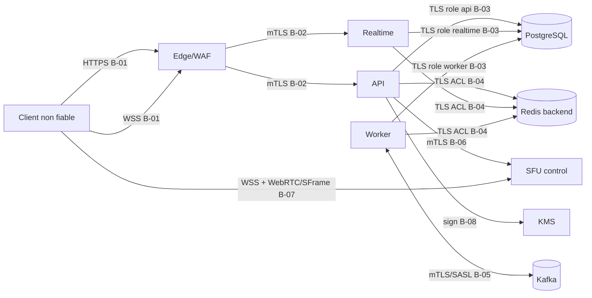

# Modele de menace et securite verifiable

## 1. Statut, objectif et methode

Ce document est le modele de menace normatif du backend Hello Friend decrit dans
`01-cadrage-backend-temps-reel.md` et `02-specification-architecture-backend.md`. Il couvre les
modes visioconference, appel audio et live, le chat chiffre, les reunions sans compte, l'integration
SFU et les dependances de donnees. Il ne remplace ni une revue de code, ni des tests d'intrusion, ni
la reponse a incident.

La methode combine :

1. des diagrammes de flux de donnees et leurs frontieres de confiance ;
2. STRIDE pour examiner chaque composant et chaque flux ;
3. des cas d'abus propres au produit et aux invitations anonymes ;
4. un registre de risques priorise ;
5. une tracabilite entre menaces, controles, tests et signaux d'exploitation.

Le modele doit etre revu a chaque nouvelle surface publique, changement E2EE, nouveau fournisseur,
nouvelle classe de donnees ou modification d'une frontiere de confiance. Une revue trimestrielle et
une revue avant chaque mise en production majeure sont obligatoires. Cette approche suit la
recommandation OWASP de traiter le threat modeling comme un processus continu, fonde sur des DFD et
non comme un document produit une seule fois.[^owasp-tm]

### 1.1 Objectifs de securite

- seuls les detenteurs d'une capacite valide rejoignent une reunion ;
- une capacite invite ne permet jamais d'exercer les pouvoirs de l'hote ;
- le serveur ne peut pas dechiffrer les contenus E2EE ni les medias SFrame ;
- le SFU ne recoit que les permissions minimales necessaires au mode et au role ;
- PostgreSQL reste l'autorite durable et atomique ;
- la perte de Redis, Kafka ou d'un pod ne fait perdre aucun message confirme ;
- les commandes, messages et evenements rejoues restent idempotents ;
- une panne de dependance ferme les actions sensibles plutot que de les autoriser ;
- les secrets n'entrent ni dans les URL serveur, ni dans les logs, metriques, traces, erreurs,
  images ou artefacts de build ;
- tout controle critique possede un test et un signal observable.

### 1.2 Non-objectifs et limites explicites

- proteger un terminal deja compromis ou une extension navigateur malveillante ;
- empecher un participant legitime de filmer son ecran ou recopier un contenu ;
- moderation serveur du contenu E2EE en clair ;
- anonymat reseau face au fournisseur d'acces ou a l'hebergeur ;
- inventer une primitive cryptographique ou une implementation MLS/SFrame maison ;
- rendre compatible un enregistrement serveur invisible avec une reunion E2EE.

## 2. Portee et actifs

### 2.1 Actifs critiques

| ID   | Actif                                                        | Sensibilite | Propriete attendue                                 |
| ---- | ------------------------------------------------------------ | ----------: | -------------------------------------------------- |
| A-01 | capacites hote et invite en clair                            |    critique | confidentialite, usage borne, revocation           |
| A-02 | digests de capacites                                         |      elevee | integrite, resistance au brute force               |
| A-03 | cookies de session anonyme                                   |    critique | confidentialite, liaison au contexte, expiration   |
| A-04 | tickets WSS et admissions SFU                                |    critique | usage unique, faible TTL, audience stricte         |
| A-05 | cles privees de signature backend/KMS                        |    critique | non-exportabilite, rotation, separation des usages |
| A-06 | secrets MLS et cles SFrame                                   |    critique | exclusivement sur les terminaux autorises          |
| A-07 | ciphertext, artefacts MLS publics et epochs                  |      elevee | integrite, ordre, disponibilite                    |
| A-08 | reunions, participants, roles et etats                       |      elevee | integrite transactionnelle                         |
| A-09 | historique de chat chiffre                                   |      elevee | durabilite, ordre, retention, non-divulgation      |
| A-10 | outbox, inbox et resultats idempotents                       |      elevee | atomicite, unicite, reprise                        |
| A-11 | journaux d'audit de securite                                 |      elevee | integrite, minimisation, acces restreint           |
| A-12 | donnees de presence et metadonnees                           |     moderee | minimisation, TTL, acces restreint                 |
| A-13 | configuration, ACL et secrets d'infrastructure               |    critique | confidentialite, integrite, tracabilite            |
| A-14 | disponibilite API, realtime, worker, PG, Redis, Kafka et SFU |      elevee | resilience, quotas, reprise                        |
| A-15 | code, dependances, images et pipeline de livraison           |    critique | provenance, integrite, reproductibilite            |

### 2.2 Donnees interdites

Le backend ne doit jamais persister : texte clair E2EE, secret de groupe MLS, cle de contenu SFrame,
capacite brute, mot de passe Redis/PostgreSQL dans un log, SDP/ICE complet dans les traces, cookie
brut, ticket brut ou admission SFU brute. Toute apparition est un incident P0 avec arret de la
collecte concernee, rotation des secrets exposes et analyse de portee.

## 3. Acteurs et adversaires

| ID   | Acteur/adversaire                       | Capacites considerees                                                        |
| ---- | --------------------------------------- | ---------------------------------------------------------------------------- |
| P-01 | hote legitime                           | cree, invite, modere et termine sa reunion                                   |
| P-02 | invite legitime                         | rejoint avec un secret partage et utilise son role                           |
| P-03 | viewer live                             | recoit medias/chat sans droit de production                                  |
| T-01 | internaute non authentifie              | scanne, brute force, surcharge, envoie des entrees arbitraires               |
| T-02 | participant malveillant                 | possede une capacite invite et tente une elevation ou un abus metier         |
| T-03 | voleur de lien/cookie                   | rejoue un secret obtenu par historique, capture, referer ou terminal partage |
| T-04 | attaquant reseau                        | observe/modifie les flux hors TLS ou exploite une mauvaise terminaison proxy |
| T-05 | navigateur/site hostile                 | tente CSWSH, CORS, fixation, XSS ou exfiltration par sous-ressource          |
| T-06 | pod/dependance compromis                | lit sa memoire, appelle des reseaux voisins, falsifie des evenements         |
| T-07 | operateur trop privilegie               | accede aux sauvegardes, journaux, KMS ou consoles                            |
| T-08 | fournisseur/chaine logicielle compromis | livre une dependance, image ou artefact altere                               |
| T-09 | client obsolete ou modifie              | viole le protocole, rejoue, envoie de faux epochs ou ciphertexts malformes   |

Hypotheses : le systeme d'exploitation des terminaux sains protege les cles locales ; TLS,
PostgreSQL, Redis, Kafka, le KMS et la bibliotheque E2EE retenue sont correctement maintenus ; les
acces humains de production utilisent MFA, RBAC et des traces d'audit. Chaque hypothese doit etre
validee au deploiement.

## 4. Frontieres de confiance et DFD

### 4.1 Frontieres

| ID   | Frontiere                          | Regle                                                                      |
| ---- | ---------------------------------- | -------------------------------------------------------------------------- |
| B-01 | navigateur vers edge               | Internet hostile ; TLS, origine exacte, limites et validation obligatoires |
| B-02 | edge vers API/realtime             | mTLS ou identite de workload ; en-tetes transmis allow-listes              |
| B-03 | processus vers PostgreSQL          | role SQL minimal distinct ; TLS verifie ; requetes parametrees             |
| B-04 | processus vers Redis backend       | ACL minimale distincte ; TLS ; espace de cles backend uniquement           |
| B-05 | worker vers Kafka                  | mTLS/SASL, ACL par topic et schema strict                                  |
| B-06 | API vers SFU control               | mTLS, audience explicite, aucune classe interne partagee                   |
| B-07 | client vers SFU                    | signaling WSS et WebRTC ; admission courte et permissionnelle              |
| B-08 | backend vers KMS                   | identite workload, cle non exportable et action `sign` uniquement          |
| B-09 | operateur vers production          | SSO/MFA, bastion, moindre privilege, approbation et audit                  |
| B-10 | pipeline vers registre/deploiement | artefacts signes, provenance et promotion immuable                         |

Le Redis backend et le Redis du SFU sont deux frontieres et deux deploiements distincts. Aucun role,
mot de passe, prefixe ou commande d'administration n'est partage entre eux.

### 4.2 Diagramme de contexte

### 4.3 Flux sensibles

| ID   | Flux                     | Donnee                                    | Validation de destination                                   |
| ---- | ------------------------ | ----------------------------------------- | ----------------------------------------------------------- |
| F-01 | creation de reunion      | mode, options, credential appareil        | schema ferme, quotas, idempotency key                       |
| F-02 | lien partage vers client | fragment avec capacite                    | jamais envoye comme URL HTTP, efface de l'historique        |
| F-03 | join                     | meetingId, capacite, nom, preuve appareil | digest constant-time, TTL, etat et role                     |
| F-04 | cookie session           | identifiant opaque                        | Secure, HttpOnly, SameSite, rotation et expiration          |
| F-05 | ticket WSS               | opaque, usage unique                      | digest Redis, audience, origine, TTL, consommation atomique |
| F-06 | commande realtime        | enveloppe versionnee                      | session, role, sequence, taille, quota, idempotence         |
| F-07 | message chat             | ciphertext + metadata E2EE                | taille, signature, groupe, epoch, membre, ordre             |
| F-08 | admission SFU            | JWT Ed25519                               | audience, room, participant, permissions, jti et faible TTL |
| F-09 | evenement SFU            | enveloppe Kafka                           | schema, signature/transport, topic, eventId, monotonie      |
| F-10 | ligne outbox             | evenement durable                         | destination allow-listee, lease et tentatives bornees       |
| F-11 | artefact MLS public      | KeyPackage/Commit/Welcome opaque          | bibliotheque auditee, signature, epoch, limites             |
| F-12 | sauvegarde               | donnees PostgreSQL chiffrees              | KMS, retention, restauration testee, acces audite           |

## 5. Analyse STRIDE

### 5.1 Spoofing

| Menace | Scenario                     | Controles obligatoires                                                                       |
| ------ | ---------------------------- | -------------------------------------------------------------------------------------------- |
| S-01   | deviner une capacite         | espace aleatoire >= 256 bits, digest HMAC versionne, quotas par IP/reunion, reponse uniforme |
| S-02   | rejouer un ticket WSS        | nonce aleatoire, TTL court, `GETDEL`/script atomique, audience et session active             |
| S-03   | forger une admission SFU     | Ed25519 KMS, `kid`, `iss`, `aud`, `nbf`, `exp`, `jti`, JWKS cache borne                      |
| S-04   | usurper un appareil E2EE     | credential signe, preuve de possession, KeyPackage valide, liaison session/appareil          |
| S-05   | falsifier un evenement SFU   | ACL Kafka, mTLS, schema ferme, topic attendu, inbox unique, identifiants concordants         |
| S-06   | CSWSH depuis un site hostile | validation exacte de `Origin` avant upgrade et ticket non transportable                      |

### 5.2 Tampering

| Menace | Scenario                       | Controles obligatoires                                                                   |
| ------ | ------------------------------ | ---------------------------------------------------------------------------------------- |
| T-10   | modifier role/mode cote client | calcul serveur des permissions depuis etat durable, aucune confiance dans le role fourni |
| T-11   | modifier/ordonner un chat      | signature E2EE, epoch valide, compteur/position PostgreSQL sous verrou                   |
| T-12   | double livraison outbox        | `event_id` stable, inbox/consommateur idempotent, etat monotone                          |
| T-13   | alteration migration           | manifeste ordonne, checksum SHA-256 durable, verrou advisory, transaction                |
| T-14   | alteration sauvegarde/image    | chiffrement, checksums, signature d'artefact, provenance et test de restauration         |
| T-15   | mass assignment                | DTO strict, proprietes inconnues refusees, mapping explicite vers commandes domaine      |

### 5.3 Repudiation

| Menace | Scenario                  | Controles obligatoires                                                                    |
| ------ | ------------------------- | ----------------------------------------------------------------------------------------- |
| R-01   | nier une moderation       | audit append-only avec acteur pseudonyme, action, cible, resultat, traceId et horodatage  |
| R-02   | nier une admission        | audit du digest/jti non reutilisable, politique et version de cle, jamais le token brut   |
| R-03   | perdre la causalite       | requestId/traceId, commandId/eventId, horloge UTC et propagation controlee                |
| R-04   | operateur non attribuable | identite humaine nominative, MFA, journal de controle et suppression des comptes partages |

### 5.4 Information disclosure

| Menace | Scenario                       | Controles obligatoires                                                                      |
| ------ | ------------------------------ | ------------------------------------------------------------------------------------------- |
| I-01   | fuite du lien via Referer      | secret dans fragment, `Referrer-Policy: no-referrer`, retrait immediat du fragment          |
| I-02   | logs/traces exposent un secret | redaction recursive, allow-list des attributs, tests sentinelles, acces et retention bornes |
| I-03   | backend lit un contenu E2EE    | ciphertext uniquement, MLS/SFrame standard, aucune cle serveur, tests de format/persistance |
| I-04   | enumeration de reunion         | UUID non devinable, reponses et temps normalises, aucun endpoint public de recherche        |
| I-05   | metadonnees trop longues       | minimisation, TTL presence/tickets, partition et purge durable auditee                      |
| I-06   | Swagger expose en production   | desactive par defaut staging/prod, exposition interne authentifiee si necessaire            |
| I-07   | URL de dependance divulguee    | secrets montes par fichier, messages d'erreur sanitisés, configuration jamais serialisee    |

### 5.5 Denial of service

| Menace | Scenario                      | Controles obligatoires                                                                    |
| ------ | ----------------------------- | ----------------------------------------------------------------------------------------- |
| D-01   | flood HTTP/WSS                | limites edge et processus, quotas hierarchiques, deadlines, taille max, file bornee       |
| D-02   | connexion lente               | timeouts handshake/request/idle, heartbeat et nombre maximal de sockets par identite      |
| D-03   | ciphertext/decompression bomb | compression WSS desactivee, taille avant parsing, schema et profondeur bornes             |
| D-04   | saturation PostgreSQL         | pool borne par role, timeout acquisition/requete/lock/idle transaction, admission control |
| D-05   | saturation Redis              | commandes allow-listees, timeout/abort, `maxmemory noeviction`, quotas et alertes         |
| D-06   | outbox poison                 | retries bornes avec jitter, dead-letter durable, alerte, aucune boucle chaude             |
| D-07   | fan-out live massif           | backpressure par socket, viewer sans production, pagination/rattrapage bornes             |
| D-08   | cout cryptographique          | limites KeyPackage/Commit, validation asynchrone bornee, quotas par session/appareil      |

### 5.6 Elevation of privilege

| Menace | Scenario                            | Controles obligatoires                                                                  |
| ------ | ----------------------------------- | --------------------------------------------------------------------------------------- |
| E-01   | invite devient hote                 | capacites separees, digest et kind lies, autorisation serveur a chaque commande         |
| E-02   | viewer produit                      | admission SFU sans transport send ni `produce`, controles backend et SFU concordants    |
| E-03   | mode audio produit video            | matrice mode/role centralisee et tests contractuels de chaque combinaison               |
| E-04   | service utilise role DB admin       | utilisateurs runtime sans DDL/BYPASSRLS, role migration separe et non partage           |
| E-05   | pod accede a tous les secrets       | identite workload et secret par processus, egress policy, volumes en lecture seule      |
| E-06   | SSRF atteint metadata/control plane | aucune URL utilisateur, destinations allow-listees, egress deny-by-default, IMDS bloque |

## 6. Cas d'abus produit

### 6.1 Reunion anonyme et capacites

1. **Partage involontaire du lien.** La capacite est retiree du fragment et gardee uniquement le
   temps de l'echange contre un cookie. L'UI permet a l'hote de revoquer et regenerer l'invitation
   sans changer la capacite hote.
2. **Brute force distribue.** L'entropie reste la defense principale ; les quotas par prefixe IP,
   meetingId et empreinte de capacite reduisent le volume sans devenir le seul controle. Les echecs
   ne confirment pas l'existence d'une salle.
3. **Vol d'un cookie.** Rotation au join/rejoin, expiration absolue et inactive, `Secure`,
   `HttpOnly`, `SameSite`, invalidation durable et fermeture realtime.
4. **Fixation de session.** Le serveur genere l'identifiant apres validation et n'accepte jamais un
   identifiant choisi par le client.
5. **Nom trompeur.** Un nom d'affichage n'est jamais une identite ni une preuve de role ; il est
   borne, normalise, encode a l'affichage et peut etre duplique.

### 6.2 Chat E2EE

- Un message n'est confirme qu'apres commit atomique du ciphertext et de l'outbox.
- La position est attribuee par reunion dans PostgreSQL ; Redis ne definit jamais l'ordre durable.
- `clientMessageId`, session, groupe et epoch sont verifies ensemble pour empecher substitution,
  rejeu et confusion inter-reunions.
- L'historique est pagine par curseur opaque borne. Une reconnexion relit PostgreSQL puis bascule
  vers le flux live avec deduplication.
- Les accusés envoye/recu/lu, reactions et indicateurs de saisie utilisent des schemas distincts.
  Les signaux ephemeres ont un TTL et ne sont pas transformes silencieusement en historique durable.
- Le serveur valide l'enveloppe MLS avec une bibliotheque maintenue, mais ne dechiffre pas le
  contenu applicatif.

### 6.3 Visioconference, audio et live

- Les permissions SFU sont derivees de la matrice mode/role de la specification.
- Un viewer live ne recoit jamais `transport:send`, `produce:audio` ou `produce:video`.
- Un participant audio ne recoit jamais `produce:video`.
- Une admission n'est delivree qu'a une session active et, lorsque E2EE est requis, a un appareil
  membre de l'epoch attendu.
- Terminer/revoquer est idempotent : session, realtime, groupe E2EE et SFU sont coordonnes par etat
  durable et outbox, sans appel reseau dans la transaction.
- Le downgrade E2EE vers non-E2EE n'est jamais implicite. Un changement exige une nouvelle politique
  explicite visible de tous les participants.

### 6.4 Abus de logique metier

Chaque sequence est testee aussi comme workflow, pas seulement endpoint par endpoint : join apres
fin, double join concurrent, revocation pendant admission, ancien epoch, message apres revocation,
double fin, ticket deja consomme, commande hors role, changement d'ordre et reprise apres timeout
ambigu. OWASP souligne que ces abus dependent du contexte metier et echappent souvent aux
validations generiques.[^owasp-logic]

## 7. Controles d'implementation

### 7.1 Frontiere HTTP et WebSocket

- TLS 1.2 minimum, TLS 1.3 prefere, HSTS a l'edge et aucun contenu mixte ;
- CORS et `Origin` par comparaison exacte d'une liste fermee ;
- CSP stricte, Helmet, `Referrer-Policy: no-referrer`, type MIME explicite ;
- validation Zod/DTO stricte avant domaine, tailles et nombres bornes ;
- probleme RFC 9457 sans stack, SQL, adresse interne ni detail de dependance ;
- WSS authentifie avant abonnement, puis autorisation par message ;
- heartbeat, backpressure, limite de frame et compression desactivee ;
- fermeture explicite sur surcharge, schema invalide, sequence impossible ou revocation ; aucune
  file memoire non bornee.

Ces controles suivent les recommandations OWASP WebSocket : WSS, validation d'origine, autorisation
par message, limites de taille, rate limiting, heartbeat, gestion de backpressure et exclusion des
donnees sensibles des logs.[^owasp-ws]

### 7.2 PostgreSQL

- requetes parametrees uniquement ; identifiants SQL issus d'enums internes ;
- transaction executee avec un seul `PoolClient`, jamais `pool.query` ;
- ordre de verrouillage documente et invariant pour eviter les deadlocks ;
- `statement_timeout`, `lock_timeout`, `idle_in_transaction_session_timeout` et timeout
  d'acquisition de pool ;
- pool calcule selon le budget global des replicas, avec marge d'administration ;
- roles runtime distincts, schema non public, `search_path` fixe et privileges par defaut revoques ;
  role migration distinct ;
- TLS avec verification de certificat en staging/production ;
- migrations checksumees sous verrou advisory et sauvegarde/restauration PITR testee avant
  changements destructifs.

node-postgres impose d'utiliser le meme client pour toute une transaction et recommande les requetes
parametrees contre l'injection SQL.[^pg-tx][^pg-query]

### 7.3 Redis backend

- instance, ACL et secrets distincts du SFU ; acces reseau prive uniquement ;
- TLS et verification du certificat en staging/production ;
- trois connexions logiques : commandes, publication, souscription ;
- client avec listener `error`, connect timeout, command timeout, reconnexion bornee avec jitter et
  offline queue desactivee pour les commandes sensibles ;
- cles centralisees et versionnees, composants encodes et longueurs bornees ;
- TTL obligatoire pour ticket, presence, quota et lease ;
- `maxmemory-policy noeviction` et alerte avant saturation ;
- Pub/Sub traite comme at-most-once : rattrapage et verite dans PostgreSQL.

La documentation Redis confirme que Pub/Sub est at-most-once et qu'un abonne deconnecte perd les
messages ; il ne peut donc pas porter la durabilite du chat.[^redis-pubsub] L'acces Redis doit
rester prive avec ACL et TLS.[^redis-sec]

### 7.4 Secrets, KMS et cryptographie

- secrets injectes par fichiers montes en lecture seule, pas par arguments CLI ;
- refus des secrets bruts dans l'environnement staging/production ;
- fichier regulier, non symlink, taille bornee, permissions restrictives et repertoire de secrets
  allow-liste ;
- cle d'admission Ed25519 distincte de la credential E2EE et de toute cle SFU ;
- rotation avec chevauchement public `kid`, retrait apres TTL maximal et cache ;
- comparaison constant-time des digests de capacites ;
- MLS et SFrame par bibliotheques standards auditees, avec vecteurs et tests d'interoperabilite ;
  aucune primitive locale.

### 7.5 Supply chain et deploiement

- lockfile obligatoire, `npm ci`, versions exactes et audit automatise ;
- SBOM, scan SCA/image/secret, analyse statique et tests avant promotion ;
- image multi-stage, utilisateur non-root, filesystem lecture seule, capabilities Linux retirees et
  seccomp ;
- artefact unique signe, digest immuable entre staging et production ;
- migrations executees par job unique avant rollout compatible ;
- NetworkPolicy deny-by-default et egress strict par role ;
- deploiement progressif, PodDisruptionBudget, anti-affinite et rollback teste.

## 8. Registre de risques

| ID    | Risque                              |       Impact |  Vraisemblance |       Priorite | Traitement requis                               |
| ----- | ----------------------------------- | -----------: | -------------: | -------------: | ----------------------------------------------- |
| RK-01 | vol/rejeu capacite ou session       |     critique |        moyenne |             P0 | C-01, C-02, C-03, tests TST-01..04              |
| RK-02 | elevation invite/viewer             |     critique |        moyenne |             P0 | C-04, matrice contractuelle TST-05              |
| RK-03 | fuite de clair/cle E2EE             |     critique | faible-moyenne |             P0 | C-05, C-06, sentinelles TST-06                  |
| RK-04 | divergence message/outbox           |        eleve |        moyenne |             P0 | C-07, transactions TST-07                       |
| RK-05 | perte Pub/Sub prise pour durabilite |        eleve |        moyenne |             P0 | C-08, panne/replay TST-08                       |
| RK-06 | injection SQL/mass assignment       |     critique |        moyenne |             P0 | C-09, tests adversariaux TST-09                 |
| RK-07 | saturation pool/sockets             |        eleve |         elevee |             P0 | C-10, charge/soak TST-10                        |
| RK-08 | role infrastructure trop large      |     critique |        moyenne |             P0 | C-11, test de permissions TST-11                |
| RK-09 | evenement SFU forge/rejoue          |        eleve |        moyenne |             P1 | C-12, contrat/inbox TST-12                      |
| RK-10 | migration alteree/concurrente       |        eleve |         faible |             P1 | C-13, TST-13                                    |
| RK-11 | exposition logs/Swagger             |        eleve |        moyenne |             P1 | C-14, TST-14                                    |
| RK-12 | compromission supply chain          |     critique | faible-moyenne |             P1 | C-15, controles pipeline TST-15                 |
| RK-13 | abus de cout par invite legitime    | modere-eleve |         elevee |             P1 | C-16, quotas TST-16                             |
| RK-14 | operateur abusif                    |     critique |         faible |             P1 | C-17, acces/audit TST-17                        |
| RK-15 | terminal participant compromis      |     critique |        moyenne | accepte/limite | notification, revocation appareil, transparence |
| RK-16 | capture externe par participant     |        eleve |        moyenne |        accepte | communication produit et controles hote         |

Un risque P0 bloque le lancement tant que son controle et son test ne sont pas verts. Un risque P1
bloque la production sauf acceptation ecrite, datee, avec proprietaire et date d'expiration. Les
risques acceptes ne sont pas presentes comme resolus.

## 9. Catalogue de controles et preuves

| ID   | Controle                                                      | Preuve attendue                              |
| ---- | ------------------------------------------------------------- | -------------------------------------------- |
| C-01 | capacites 256 bits, HMAC versionne, comparaison constant-time | test entropie/format et revue crypto         |
| C-02 | cookie securise, rotation, expiration, revocation             | test navigateur et integration               |
| C-03 | ticket/admission usage unique et TTL court                    | test concurrence et horloge                  |
| C-04 | autorisation centrale mode/role/action                        | matrice exhaustive                           |
| C-05 | serveur sans secrets E2EE                                     | inspection schema/log/trace et interop       |
| C-06 | redaction et minimisation                                     | tests sentinelles imbriques/cycles/URL       |
| C-07 | mutation et outbox atomiques                                  | crash injection avant/apres commit           |
| C-08 | rattrapage PostgreSQL et deduplication                        | perte Redis, reconnexion et trou de sequence |
| C-09 | validation stricte et SQL parametre                           | tests injection/proprietes inconnues         |
| C-10 | limites, deadlines et backpressure                            | charge, soak, chaos et budget pool           |
| C-11 | moindre privilege DB/Redis/Kafka/KMS                          | tests negatifs avec identites runtime        |
| C-12 | contrat SFU, inbox et monotonie                               | contract tests sur exemples SFU reels        |
| C-13 | migrations verrouillees et checksumees                        | double runner, checksum change, rollback     |
| C-14 | erreurs/docs/logs non sensibles                               | snapshots et scanner de secrets              |
| C-15 | provenance et artefacts immuables                             | signature, SBOM, digest de promotion         |
| C-16 | quotas hierarchiques                                          | tests de rafale et repartition               |
| C-17 | MFA/RBAC/audit humain                                         | export IAM et exercice d'acces               |

## 10. Strategie de verification

### 10.1 Pyramide de tests de securite

1. **Unitaires** : parsers, autorisations, transitions, cles Redis, redaction, validation
   d'enveloppes et calcul des TTL.
2. **Integration reelle** : PostgreSQL et Redis versions ciblees, transactions, timeouts, ACL, TLS,
   concurrence, migrations et reprise.
3. **Contractuels** : OpenAPI, protocole realtime, schemas Kafka et admission SFU.
4. **End-to-end multi-client** : creation, deux onglets, visio/audio/live, chat, reconnexion,
   revocation, fin et ancien client.
5. **Adversariaux** : fuzz schemas, rejeu, confusion cross-room, CSWSH, injections, limites et
   workflows hors ordre.
6. **Performance/chaos** : charge soutenue, perte Redis/Kafka/pod, bascule PG, partition reseau,
   pool epuise et shutdown pendant transaction.

### 10.2 Tests de sortie minimaux

| ID     | Verification bloquante                                             |
| ------ | ------------------------------------------------------------------ |
| TST-01 | impossible de deviner/enumerer une salle par les reponses          |
| TST-02 | capacite invite refusee pour chaque action hote                    |
| TST-03 | ticket WSS concurrent consomme une seule fois                      |
| TST-04 | revocation ferme session, WSS et admission SFU                     |
| TST-05 | toutes combinaisons mode/role/permission SFU                       |
| TST-06 | aucune sentinelle secret/clair dans PG, Redis, Kafka, logs, traces |
| TST-07 | crash autour du commit ne perd ni ne cree une mutation orpheline   |
| TST-08 | perte Pub/Sub suivie d'un rattrapage sans trou                     |
| TST-09 | injection et proprietes inconnues refusees sans effet              |
| TST-10 | objectifs p95/p99 et memoire stable sous charge/soak               |
| TST-11 | identites runtime incapables de DDL/admin/acces cross-service      |
| TST-12 | evenement SFU duplique, ancien ou invalide sans corruption         |
| TST-13 | migration concurrente unique et checksum immuable                  |
| TST-14 | OpenAPI production ferme et erreurs/logs sanitisés                 |
| TST-15 | build reproductible, SBOM, signature et scan sans critique         |
| TST-16 | quotas efficaces sans contournement evident                        |
| TST-17 | acces d'urgence, restauration et rotation executes en exercice     |

## 11. Detection, reponse et confidentialite operationnelle

Alertes obligatoires : hausse de join refuses, reutilisation de ticket, echec de signature,
permission SFU refusee, mismatch E2EE epoch, saturation pool, timeout de lock, age outbox,
dead-letter, retard Kafka, eviction Redis, reconnexions, backpressure, fermeture WSS anormale et
scanner de secret. Les labels n'incluent jamais meetingId, participantId ou adresse IP brute afin
d'eviter cardinalite et fuite. Les identifiants necessaires a une enquete restent dans des logs
d'acces restreint, pseudonymises et soumis a retention.

Playbooks obligatoires : fuite de capacite, fuite de cle de signature, suspicion de clair E2EE,
compromission de compte operateur, corruption/perte PostgreSQL, panne Redis, poison outbox/Kafka,
attaque de disponibilite et dependance critique. Chaque playbook definit confinement,
rotation/revocation, communication, restauration, collecte de preuves et retour d'experience.

## 12. Criteres de passage en production

Le backend n'est declare pret que lorsque :

- tous les risques P0 ont controle, proprietaire et test vert ;
- les tests TST-01 a TST-17 sont executes dans un environnement proche production ;
- OpenAPI, TypeDoc, lint, types, tests, couverture, build et audit sont verts ;
- ACL et tests negatifs PostgreSQL/Redis/Kafka/KMS sont verifies ;
- restauration PostgreSQL et rotations de cles/capacites sont exercees ;
- charge, soak, chaos, bascule et graceful shutdown respectent les SLO ;
- les images et dependances n'ont aucune vulnerabilite critique non acceptee ;
- une revue independante de l'E2EE et un pentest des flux anonymes/WSS sont clos ;
- rollback applicatif et migration compatible sont testes ;
- les tableaux de bord, alertes et playbooks sont accessibles aux operateurs.

## 13. Journal de revue

| Version | Date       | Portee                                                          | Decision                           |
| ------- | ---------- | --------------------------------------------------------------- | ---------------------------------- |
| 0.1     | 2026-09-12 | modele initial avant infrastructure PG/Redis et domaine reunion | controles a implementer et prouver |

Toute modification ajoute une ligne, les menaces affectees, le proprietaire et les preuves
relancees. Supprimer une menace exige une justification ; elle ne doit pas simplement disparaitre du
registre.

## References officielles

[^owasp-tm]:
    OWASP,
    [Threat Modeling Cheat Sheet](https://cheatsheetseries.owasp.org/cheatsheets/Threat_Modeling_Cheat_Sheet.html).

[^owasp-logic]:
    OWASP,
    [Business Logic Abuse Cheat Sheet](https://cheatsheetseries.owasp.org/cheatsheets/Business_Logic_Abuse_Cheat_Sheet.html).

[^owasp-ws]:
    OWASP,
    [WebSocket Security Cheat Sheet](https://cheatsheetseries.owasp.org/cheatsheets/WebSocket_Security_Cheat_Sheet.html).

[^pg-tx]: node-postgres, [Transactions](https://node-postgres.com/features/transactions).

[^pg-query]:
    node-postgres, [Queries and parameterized queries](https://node-postgres.com/features/queries).

[^redis-pubsub]: Redis, [Pub/Sub delivery semantics](https://redis.io/docs/latest/develop/pubsub/).

[^redis-sec]:
    Redis, [Security](https://redis.io/docs/latest/operate/oss_and_stack/management/security/).
